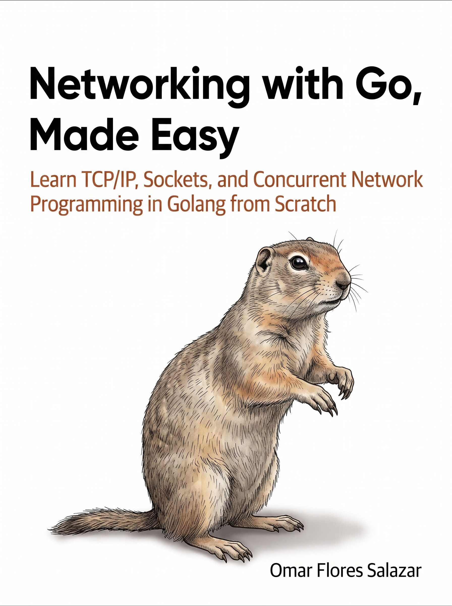

# Networking with Go, Made Easy

[](https://golang.org/)
[](https://opensource.org/licenses/MIT)
[](https://creativecommons.org/licenses/by-nc/4.0/)
[](https://makeapullrequest.com)
[](https://github.com/sindresorhus/awesome)
[](https://sazardev.github.io/networking-with-go/)

<p align="center">
  
</p>

---

**Networking with Go, Made Easy** is a free, hands-on book that teaches computer networking and network programming in Go, end to end: how networks actually work, how to write real networking code in Go, and how to use that code for building production-grade APIs and doing offensive/defensive security work.

It is written for three audiences at once:

- **Newcomers to networking** who want the concepts explained clearly, with analogies and diagrams, before ever touching code.
- **Newcomers to Go** who know some programming but not Go itself, and need a real, thorough on-ramp to the language — including its single most important feature, concurrency.
- **Working developers** who already know both, and want a deep, practical reference for building networked systems, production APIs (with real databases, containers, and cloud deployment), and security tooling in Go specifically.

Every chapter is a `.mdx` file under `docs/`, and the whole book can be compiled into a single print-ready PDF with [go-pretty-pdf](https://github.com/sazardev/go-pretty-pdf) (see [Building the PDF](#building-the-pdf) below).

> **What makes this guide different**
> - Theory first, then code: every networking concept gets explained conceptually before you see a line of Go.
> - A dedicated Go Fundamentals section, so "Part 2" doesn't assume you already know the language — with a full, flagship-depth chapter on goroutines, channels, and concurrency, Go's signature feature.
> - Every hands-on example is a complete, runnable program, not a fragment — copy it, run it, break it, change it.
> - Practical warnings and pitfalls called out explicitly (resource leaks, race conditions, insecure defaults), not just happy-path code.
> - It goes past "hello world" networking into production APIs (real SQL/SQLite databases, Docker, Google Cloud, Kubernetes-style orchestration, Clean/Hexagonal Architecture, Domain-Driven Design) and offensive/defensive security.

---

## Table of Contents

Chapters are listed in reading order. Each links straight to its file — click any of them to jump in.

**Front matter:** [About the Author](docs/front-matter/01-about-the-author.mdx)

### Part 1: Networking Theory and Concepts
Pure conceptual grounding: how networks are built and how data actually moves — real history, analogies, and stories, no code at all. This part is entirely about building a rock-solid mental model before you write a single line of Go, which starts fresh in the very next part.

1. [Introduction to Networking](docs/part1/01-introduction-to-networking.mdx)
2. [History and Evolution of Computer Networks](docs/part1/02-history-and-evolution-of-computer-networks.mdx)
3. [Types of Networks: LAN, WAN, MAN, PAN](docs/part1/03-types-of-networks.mdx)
4. [Network Topologies and Architectures](docs/part1/04-network-topologies-and-architectures.mdx)
5. [The OSI and TCP/IP Models](docs/part1/05-osi-and-tcpip-models.mdx)
6. [Understanding IP Addressing and Subnetting](docs/part1/06-understanding-ip-addressing-and-subnetting.mdx)
7. [Ports, Sockets, and Endpoints](docs/part1/07-ports-sockets-and-endpoints.mdx)
8. [TCP vs UDP: Concepts and Use Cases](docs/part1/08-tcp-vs-udp-concepts-and-use-cases.mdx)
9. [Common Network Protocols (HTTP, FTP, DNS, etc.)](docs/part1/09-common-network-protocols.mdx)
10. [Network Security Fundamentals](docs/part1/10-network-security-fundamentals.mdx)
11. [Firewalls, NAT, and VPNs](docs/part1/11-firewalls-nat-and-vpns.mdx)
12. [Network Troubleshooting and Tools](docs/part1/12-network-troubleshooting-and-tools.mdx)
13. [Performance, Latency, and Bandwidth](docs/part1/13-performance-latency-and-bandwidth.mdx)

### Go Fundamentals
A self-contained crash course in the Go language itself — not networking yet. If you already know Go well, skim it or skip to Part 2; if you don't, this is what makes the rest of the book safe to follow. Installation, exact terminal commands, and a hands-on exercise in every chapter — including a full, flagship-depth chapter on goroutines and channels, since concurrency is Go's single most important feature.

14. [Installing Go and Your First Program](docs/go-fundamentals/01-installing-go-and-your-first-program.mdx)
15. [Variables, Types, and Constants](docs/go-fundamentals/02-variables-types-and-constants.mdx)
16. [Functions and Methods](docs/go-fundamentals/03-functions-and-methods.mdx)
17. [Structs and Interfaces](docs/go-fundamentals/04-structs-and-interfaces.mdx)
18. [io.Reader, io.Writer, and Streaming Data](docs/go-fundamentals/05-io-reader-writer.mdx)
19. [Slices, Arrays, and Maps](docs/go-fundamentals/06-slices-arrays-and-maps.mdx)
20. [Error Handling in Go](docs/go-fundamentals/07-error-handling-in-go.mdx)
21. [Packages, Modules, and go.mod](docs/go-fundamentals/08-packages-modules-and-go-mod.mdx)
22. [Testing Basics with go test](docs/go-fundamentals/09-testing-basics-with-go-test.mdx)
23. [Goroutines, Channels, and Concurrency](docs/go-fundamentals/10-goroutines-channels-and-concurrency.mdx)

### Part 2: Unified Networking Topics (Theory + Practice)
Where networking theory and Go implementation merge: every chapter pairs protocol theory with a real, working Go program. This is the core of the book.

24. [Setting Up Your Go Development Environment](docs/part2/01-setting-up-your-go-development-environment.mdx)
25. [Go Language Basics for Networking](docs/part2/02-go-language-basics-for-networking.mdx)
26. [Go Networking Packages Overview](docs/part2/03-go-networking-packages-overview.mdx)
27. [Working with IP, Ports, and Addresses: Concepts and Go Implementation](docs/part2/04-working-with-ip-ports-and-addresses.mdx)
28. [TCP in Depth: Protocol Theory and Go Implementation](docs/part2/05-tcp-in-depth-protocol-theory-and-go-implementation.mdx)
29. [UDP in Depth: Protocol Theory and Go Implementation](docs/part2/06-udp-in-depth-protocol-theory-and-go-implementation.mdx)
30. [Error Handling and Debugging: Concepts and Go Implementation](docs/part2/07-error-handling-and-debugging.mdx)
31. [Concurrency in Networking: Theory and Go Implementation](docs/part2/08-concurrency-in-networking.mdx)
32. [Context and Cancellation: Concepts and Go Implementation](docs/part2/09-context-and-cancellation.mdx)
33. [HTTP: Protocol Theory and Go Implementation](docs/part2/10-http-protocol-theory-and-go-implementation.mdx)
34. [Handling JSON and XML over HTTP: Concepts and Go Implementation](docs/part2/11-handling-json-and-xml-over-http.mdx)
35. [WebSockets: Real-Time Communication Theory and Go Implementation](docs/part2/12-websockets-real-time-communication.mdx)
36. [Chat Applications: Design, Protocols, and Go Implementation](docs/part2/13-chat-applications.mdx)
37. [File Transfer Applications: Protocols and Go Implementation](docs/part2/14-file-transfer-applications.mdx)
38. [Proxy Servers and Clients: Concepts and Go Implementation](docs/part2/15-proxy-servers-and-clients.mdx)
39. [DNS: Theory and Go Implementation](docs/part2/16-dns-theory-and-go-implementation.mdx)
40. [NAT Traversal and P2P Networking: Concepts and Go Implementation](docs/part2/17-nat-traversal-and-p2p-networking.mdx)
41. [Authentication and Authorization: Security Theory and Go Implementation](docs/part2/18-authentication-and-authorization.mdx)
42. [Security in Go Networking: TLS, Encryption, and Best Practices](docs/part2/19-security-in-go-networking.mdx)
43. [Logging and Monitoring: Concepts and Go Implementation](docs/part2/20-logging-and-monitoring.mdx)
44. [Testing and Debugging Go Network Applications: Theory and Practice](docs/part2/21-testing-and-debugging.mdx)
45. [Performance Optimization: Concepts and Go Implementation](docs/part2/22-performance-optimization.mdx)
46. [Deploying Go Network Applications: Best Practices](docs/part2/23-deploying-go-network-applications.mdx)
47. [Real-World Projects and Case Studies](docs/part2/24-real-world-projects-and-case-studies.mdx)
48. [Email Protocols: Theory and Go Implementation](docs/part2/25-email-protocols-theory-and-go-implementation.mdx)
49. [Further Resources and Next Steps](docs/part2/26-further-resources-and-next-steps.mdx)

### Advanced & Specialized Networking Topics
Specialized areas that build on Part 2: distributed systems protocols, infrastructure automation, and networking for specific domains (games, blockchain, big data).

50. [gRPC and Protocol Buffers in Go](docs/advanced/01-grpc-and-protocol-buffers-in-go.mdx)
51. [WebRTC and P2P Communication in Go](docs/advanced/02-webrtc-and-p2p-communication-in-go.mdx)
52. [MQTT, AMQP, and IoT Messaging Protocols](docs/advanced/03-mqtt-amqp-and-iot-messaging-protocols.mdx)
53. [SDN (Software Defined Networking) and OpenFlow with Go](docs/advanced/04-sdn-software-defined-networking-and-openflow-with-go.mdx)
54. [Network Function Virtualization (NFV) in Go](docs/advanced/05-network-function-virtualization-nfv-in-go.mdx)
55. [Deep Packet Inspection and Packet Manipulation](docs/advanced/06-deep-packet-inspection-and-packet-manipulation.mdx)
56. [Custom Protocol Design and Implementation](docs/advanced/07-custom-protocol-design-and-implementation.mdx)
57. [Cloud Networking APIs and Automation with Go](docs/advanced/08-cloud-networking-apis-and-automation-with-go.mdx)
58. [Zero Trust Networking and Microsegmentation](docs/advanced/09-zero-trust-networking-and-microsegmentation.mdx)
59. [Network Simulation and Virtual Labs](docs/advanced/10-network-simulation-and-virtual-labs.mdx)
60. [Automating Network Device Configuration](docs/advanced/11-automating-network-device-configuration.mdx)
61. [Observability and Tracing in Go Networking](docs/advanced/12-observability-and-tracing-in-go-networking.mdx)
62. [Wireless Networking and Go](docs/advanced/13-wireless-networking-and-go.mdx)
63. [Mesh Networks and Dynamic Routing](docs/advanced/14-mesh-networks-and-dynamic-routing.mdx)
64. [High Availability and Load Balancing](docs/advanced/15-high-availability-and-load-balancing.mdx)
65. [Real-Time Networking for Games](docs/advanced/16-real-time-networking-for-games.mdx)
66. [Blockchain and Cryptocurrency Networking](docs/advanced/17-blockchain-and-cryptocurrency-networking.mdx)
67. [Big Data, AI, and Streaming Networks](docs/advanced/18-big-data-ai-and-streaming-networks.mdx)
68. [Go Networking Performance Benchmarks](docs/advanced/19-go-networking-performance-benchmarks.mdx)
69. [QUIC and HTTP/3 in Go](docs/advanced/20-quic-and-http3-in-go.mdx)
70. [Message Queues and Service Discovery in Go](docs/advanced/21-message-queues-and-service-discovery-in-go.mdx)
71. [IPv6 Networking in Go](docs/advanced/22-ipv6-networking-in-go.mdx)

### Part 3: Cybersecurity & Hacking
Offensive and defensive security for networked systems, taught for authorized, ethical use: your own labs, CTFs, and systems you're authorized to test.

72. [Introduction to Cybersecurity in Networking](docs/part3/01-introduction-to-cybersecurity-in-networking.mdx)
73. [Threat Modeling and Attack Surfaces](docs/part3/02-threat-modeling-and-attack-surfaces.mdx)
74. [Common Network Attacks (DoS, MITM, Spoofing, etc.)](docs/part3/03-common-network-attacks.mdx)
75. [Network Scanning and Enumeration with Go](docs/part3/04-network-scanning-and-enumeration-with-go.mdx)
76. [Packet Sniffing and Analysis with Go](docs/part3/05-packet-sniffing-and-analysis-with-go.mdx)
77. [Vulnerability Assessment and Exploitation Basics](docs/part3/06-vulnerability-assessment-and-exploitation-basics.mdx)
78. [Building Simple Security Tools in Go](docs/part3/07-building-simple-security-tools-in-go.mdx)
79. [Penetration Testing Workflows](docs/part3/08-penetration-testing-workflows.mdx)
80. [Incident Response and Forensics](docs/part3/09-incident-response-and-forensics.mdx)
81. [Ethical Hacking and Legal Considerations](docs/part3/10-ethical-hacking-and-legal-considerations.mdx)
82. [Further Cybersecurity Resources](docs/part3/11-further-cybersecurity-resources.mdx)
83. [Implementing TLS/SSL in Go](docs/part3/12-implementing-tls-ssl-in-go.mdx)
84. [Certificate Management and PKI](docs/part3/13-certificate-management-and-pki.mdx)
85. [Secure Coding Practices in Go](docs/part3/14-secure-coding-practices-in-go.mdx)
86. [Zero Trust Networking Concepts](docs/part3/15-zero-trust-networking-concepts.mdx)
87. [Network Segmentation and Microsegmentation](docs/part3/16-network-segmentation-and-microsegmentation.mdx)
88. [IDS/IPS: Concepts and Go Implementations](docs/part3/17-ids-ips-concepts-and-go-implementations.mdx)
89. [SIEM and Log Analysis for Network Security](docs/part3/18-siem-and-log-analysis-for-network-security.mdx)
90. [Malware Analysis and Network Indicators](docs/part3/19-malware-analysis-and-network-indicators.mdx)
91. [Reverse Engineering Network Protocols](docs/part3/20-reverse-engineering-network-protocols.mdx)
92. [Red Team vs Blue Team: Concepts and Labs](docs/part3/21-red-team-vs-blue-team-concepts-and-labs.mdx)
93. [Social Engineering in Networking](docs/part3/22-social-engineering-in-networking.mdx)
94. [Wireless Network Security: Theory and Attacks](docs/part3/23-wireless-network-security-theory-and-attacks.mdx)
95. [IoT Security: Concepts and Go Implementations](docs/part3/24-iot-security-concepts-and-go-implementations.mdx)
96. [Cloud Networking Security](docs/part3/25-cloud-networking-security.mdx)
97. [Container and Kubernetes Network Security](docs/part3/26-container-and-kubernetes-network-security.mdx)
98. [Bug Bounty and Responsible Disclosure](docs/part3/27-bug-bounty-and-responsible-disclosure.mdx)
99. [Security Automation with Go](docs/part3/28-security-automation-with-go.mdx)
100. [Building a Custom Honeypot in Go](docs/part3/29-building-a-custom-honeypot-in-go.mdx)
101. [Simulating Attacks and Defense in Lab Environments](docs/part3/30-simulating-attacks-and-defense-in-lab-environments.mdx)
102. [Case Studies: Real-World Network Breaches](docs/part3/31-case-studies-real-world-network-breaches.mdx)
103. [Emerging Threats and Future Trends in Network Security](docs/part3/32-emerging-threats-and-future-trends-in-network-security.mdx)

### Part APIs: Building Modern APIs & Backends with Go
Everything about building, securing, testing, and operating HTTP APIs and backends in Go -- from `net/http` fundamentals through frameworks, real-time features, real databases (PostgreSQL, SQLite), Docker and Google Cloud deployment, production-grade architecture (Clean Architecture, Hexagonal Architecture, Domain-Driven Design), and thinking like an attacker to secure what you ship.

Chapter numbers 104-149 below map to files `01-` through `46-` under `docs/part-apis/`.

104. [API Fundamentals: REST, HTTP, and the Web](docs/part-apis/01-api-fundamentals-rest-http-and-the-web.mdx)
105. [Designing Clean URLs, Query Params, and Routing](docs/part-apis/02-designing-clean-urls-query-params-and-routing.mdx)
106. [JSON, XML, and Data Serialization](docs/part-apis/03-json-xml-and-data-serialization.mdx)
107. [Building RESTful APIs with net/http](docs/part-apis/04-building-restful-apis-with-nethttp.mdx)
108. [Building APIs with Gin](docs/part-apis/05-building-apis-with-gin.mdx)
109. [Building APIs with Fiber](docs/part-apis/06-building-apis-with-fiber.mdx)
110. [Serving HTML, Templates, and Static Files](docs/part-apis/07-serving-html-templates-and-static-files.mdx)
111. [Adding WebSockets to Your API](docs/part-apis/08-adding-websockets-to-your-api.mdx)
112. [Notifications, SSE, and Real-Time Updates](docs/part-apis/09-notifications-sse-and-real-time-updates.mdx)
113. [API Security: Tokens, Auth, and Best Practices](docs/part-apis/10-api-security-tokens-auth-and-best-practices.mdx)
114. [Rate Limiting, CORS, and API Gateways](docs/part-apis/11-rate-limiting-cors-and-api-gateways.mdx)
115. [API Documentation and OpenAPI/Swagger](docs/part-apis/12-api-documentation-and-openapiswagger.mdx)
116. [Testing and Mocking APIs](docs/part-apis/13-testing-and-mocking-apis.mdx)
117. [Versioning, Deprecation, and Maintenance](docs/part-apis/14-versioning-deprecation-and-maintenance.mdx)
118. [Prebuilt Solutions and API Boilerplates](docs/part-apis/15-prebuilt-solutions-and-api-boilerplates.mdx)
119. [API Performance, Monitoring, and Observability](docs/part-apis/16-api-performance-monitoring-and-observability.mdx)
120. [Deploying and Scaling Go APIs](docs/part-apis/17-deploying-and-scaling-go-apis.mdx)
121. [Advanced API Rate Limiting and Anti-Abuse](docs/part-apis/18-advanced-api-rate-limiting-and-anti-abuse.mdx)
122. [Advanced API Gateway and Service Mesh](docs/part-apis/19-advanced-api-gateway-and-service-mesh.mdx)
123. [APIs for Graph Databases and NoSQL](docs/part-apis/20-apis-for-graph-databases-and-nosql.mdx)
124. [APIs for Background Jobs and Task Queues](docs/part-apis/21-apis-for-background-jobs-and-task-queues.mdx)
125. [APIs for File Uploads, Media, and Streaming](docs/part-apis/22-apis-for-file-uploads-media-and-streaming.mdx)
126. [APIs for Webhooks and Event-Driven Design](docs/part-apis/23-apis-for-webhooks-and-event-driven-design.mdx)
127. [APIs for OAuth2, SSO, SAML, OpenID Connect](docs/part-apis/24-apis-for-oauth2-sso-saml-openid-connect.mdx)
128. [APIs for Multi-Tenancy and SaaS](docs/part-apis/25-apis-for-multi-tenancy-and-saas.mdx)
129. [APIs for Internationalization (i18n) and Localization (l10n)](docs/part-apis/26-apis-for-internationalization-i18n-and-localization-l10n.mdx)
130. [APIs for Feature Flags and Dynamic Config](docs/part-apis/27-apis-for-feature-flags-and-dynamic-config.mdx)
131. [APIs for Load and Stress Testing](docs/part-apis/28-apis-for-load-and-stress-testing.mdx)
132. [APIs for CI/CD and DevOps](docs/part-apis/29-apis-for-cicd-and-devops.mdx)
133. [APIs for Serverless and FaaS](docs/part-apis/30-apis-for-serverless-and-faas.mdx)
134. [APIs for Edge Computing and CDN](docs/part-apis/31-apis-for-edge-computing-and-cdn.mdx)
135. [APIs for Advanced Security](docs/part-apis/32-apis-for-advanced-security.mdx)
136. [APIs for Advanced Observability: Metrics and Logging](docs/part-apis/33-apis-for-advanced-observability-metrics-logging.mdx)
137. [APIs for Advanced Observability: Distributed Tracing](docs/part-apis/34-apis-for-advanced-observability-distributed-tracing.mdx)
138. [RPC and gRPC for APIs](docs/part-apis/35-rpc-and-grpc-for-apis.mdx)
139. [Working with SQL Databases: PostgreSQL](docs/part-apis/36-working-with-sql-databases-postgresql.mdx)
140. [Working with SQLite in Go](docs/part-apis/37-working-with-sqlite-in-go.mdx)
141. [Containerizing Go APIs with Docker](docs/part-apis/38-containerizing-go-apis-with-docker.mdx)
142. [Clean Architecture for Go APIs](docs/part-apis/39-clean-architecture-for-go-apis.mdx)
143. [Hexagonal Architecture (Ports and Adapters) for Go APIs](docs/part-apis/40-hexagonal-architecture-ports-and-adapters.mdx)
144. [Domain-Driven Design in Go](docs/part-apis/41-domain-driven-design-in-go.mdx)
145. [Building a Complete Project End-to-End](docs/part-apis/42-building-a-complete-project-end-to-end.mdx)
146. [Deploying to Google Cloud](docs/part-apis/43-deploying-to-google-cloud.mdx)
147. [Orchestration, Replicas, and Graceful Shutdown](docs/part-apis/44-orchestration-replicas-and-graceful-shutdown.mdx)
148. [Thinking Like an Attacker: API Security](docs/part-apis/45-thinking-like-an-attacker-api-security.mdx)
149. [Caching and Redis for Go APIs](docs/part-apis/46-caching-and-redis-for-go-apis.mdx)

**Back matter:** [A Final Word](docs/back-matter/01-a-final-word.mdx)

---

## Who is this for?
- Beginners who want networking concepts, and Go itself, explained clearly from the ground up
- Developers who already know Go but want a deep, practical reference for networked systems
- Anyone prepping for interviews, CTFs, or real-world backend/networking jobs
- Backend engineers who want a real, production-shaped example (architecture, database, Docker, cloud deploy) instead of a toy
- Security professionals and tinkerers who want offensive/defensive skills backed by working code

## How to Use This Repo
- **New to networking and Go?** Start at Part 1, go through Go Fundamentals next, then move into Part 2 in order — each chapter builds on the last.
- **Know Go already, new to networking?** Skim or skip Go Fundamentals, but still read Part 1 and Part 2 in order.
- **Know networking already, new to Go?** Skip to Go Fundamentals — don't skip chapter 22 (Goroutines, Channels, and Concurrency) even if you've used other languages' concurrency models, Go's is different — then jump straight into whichever later part matches what you're building.
- **Want the production-backend track specifically?** Part APIs chapters 137-144 (RPC/gRPC, PostgreSQL, SQLite, Docker, Clean/Hexagonal Architecture, DDD) build one coherent example project across all of them, capped by chapter 144's end-to-end walkthrough — read that run in order even if you jump around elsewhere.
- **Looking for something specific?** Use the table of contents above — every chapter is self-contained enough to read on its own, with cross-references where it depends on an earlier concept.
- Every hands-on code block is meant to be copied, run, and modified — try the "Try It Yourself" prompts, don't just read past them.
- The small runnable programs under [`exercises/`](exercises/) mirror many Part 2 chapters if you want a bare, ready-to-run version outside the prose (see `CLAUDE.md` for how to run them). Exercises currently cover Part 2 only; standalone exercises for Advanced, Part 3, and Part APIs chapters are planned and contributions are welcome.

## Building the PDF
The whole book compiles into a single PDF with [go-pretty-pdf](https://github.com/sazardev/go-pretty-pdf):

```sh
go install github.com/sazardev/go-pretty-pdf/cmd/pretty-pdf@latest
pretty-pdf check   # validate every chapter's format
pretty-pdf build   # render docs/ into the PDF configured in go-pretty-pdf.yml
```

Prebuilt PDF and EPUB downloads are available on the [GitHub Releases page](https://github.com/sazardev/networking-with-go/releases) for every tagged version.

## Contributing
PRs, issues, and suggestions are welcome — new labs, corrections, clearer explanations, or entirely new chapters. See [`.github/CONTRIBUTING.md`](.github/CONTRIBUTING.md) for the basics, and `.claude/skills/mdx-pdf-format/SKILL.md` if you're adding or editing a chapter file, for the exact format the build expects.

## License
This repository uses two licenses:
- **Code** (`exercises/`, `website/`, build tooling) — [MIT](LICENSE). Use it freely, no attribution required.
- **Book text** (`docs/**/*.mdx`, and any PDF/EPUB/HTML rendered from it) — [CC BY-NC 4.0](LICENSE-CONTENT). Free to read, share, and adapt for non-commercial use, as long as you credit Omar Flores Salazar.

## Star this repo if you find it useful!

[](https://star-history.com/#sazardev/networking-with-go&Date)

---

> "The best way to learn networking is to build, break, and secure it."
