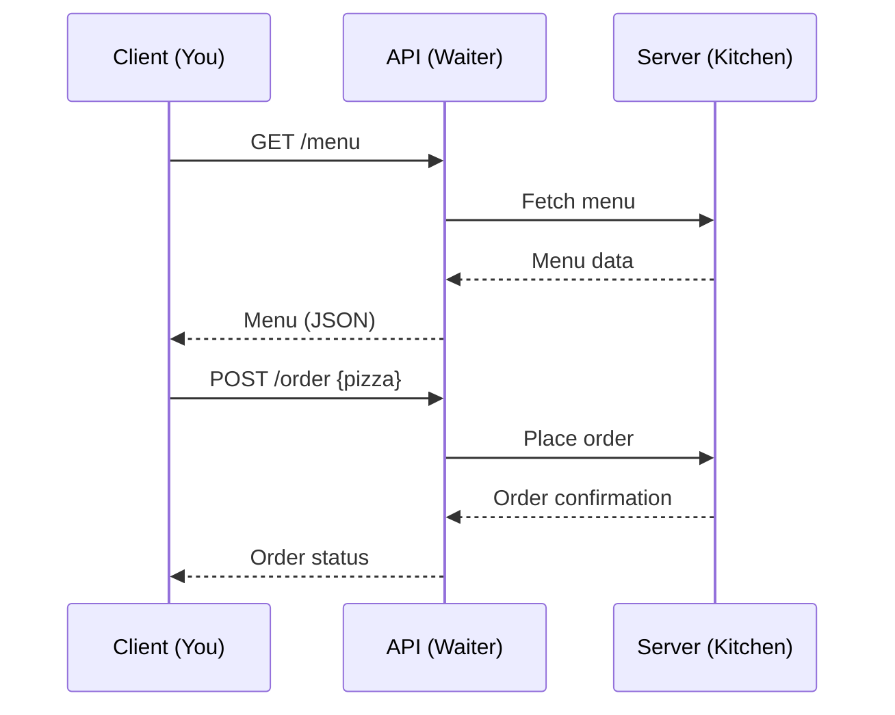

# API Fundamentals: REST, HTTP, and the Web

Welcome to **Part APIs: Building Modern APIs & Backends with Go**! 🚦🌐

APIs (Application Programming Interfaces) are the bridges and highways of the digital world. Imagine a city where every building is a different app or service—APIs are the roads, traffic lights, and intersections that let them communicate, share, and collaborate. In this section, we’ll demystify APIs, REST, and HTTP, using fun analogies, clear theory, and visual diagrams to make these concepts easy and memorable.

---

## What is an API? 🤔

Think of an API as a restaurant menu. When you visit a restaurant, you don’t go into the kitchen and cook your own food. Instead, you look at the menu (the API), choose what you want, and the kitchen (the server) prepares it for you. You don’t need to know how the food is made—you just need to know what you can order and how to ask for it.

- **API = Menu**: Lists what you can ask for.
- **Request = Your Order**: You tell the waiter what you want.
- **Response = Your Meal**: The kitchen prepares and delivers your food.

APIs let programs talk to each other in a standardized way, just like menus let customers order food without chaos.

---

## REST: The Waiter Who Follows the Rules 🍽️

REST (Representational State Transfer) is a set of rules for building APIs. Imagine a super-organized waiter who always:
- Takes orders in a specific format (GET, POST, PUT, DELETE)
- Brings food to the right table (URL)
- Delivers food in the style you want (JSON, XML, HTML)

RESTful APIs use HTTP methods to perform actions:
- **GET**: Ask for information ("Can I see the dessert menu?")
- **POST**: Add something new ("I’d like to order a pizza.")
- **PUT**: Update something ("Change my order to a salad.")
- **DELETE**: Remove something ("Cancel my order.")

---

## HTTP: The Language of the Web 🌍

HTTP (HyperText Transfer Protocol) is the language that web browsers, servers, and APIs use to talk. It’s like the rules of the road for our city of apps:
- **URLs** are addresses ("123 Main St" or "/users/42")
- **Headers** are like special instructions ("No onions, please!")
- **Body** is the main content (the actual order)

When you visit a website or use an app, you’re sending HTTP requests and getting HTTP responses all the time!

---

## Example: Ordering Pizza with HTTP 🍕

Here’s a fun analogy using HTTP to order pizza:

```http
POST /order HTTP/1.1
Host: pizzashop.com
Content-Type: application/json

{
  "topping": "pepperoni",
  "size": "large"
}
```

The server might respond:

```http
HTTP/1.1 201 Created
Content-Type: application/json

{
  "orderId": 123,
  "status": "baking"
}
```

---

## Visualizing APIs: A Mermaid Diagram



---

## Why Learn APIs with Go? 🦫

Go is a fantastic language for building APIs:
- Fast and efficient
- Simple syntax
- Great support for HTTP and web servers
- Easy to deploy

In this part, you’ll learn how to build, test, and scale APIs with Go, using real-world analogies and hands-on examples. By the end, you’ll be able to create your own digital restaurants—serving data to the world!

Let’s get started! 🚀

---
