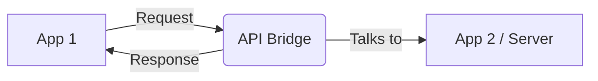
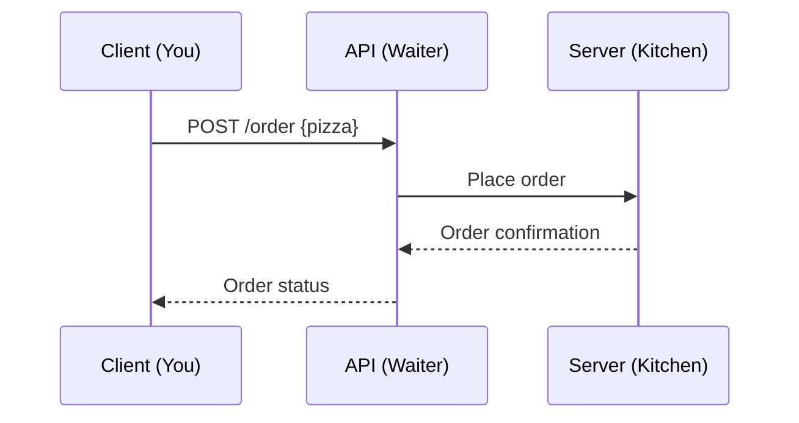
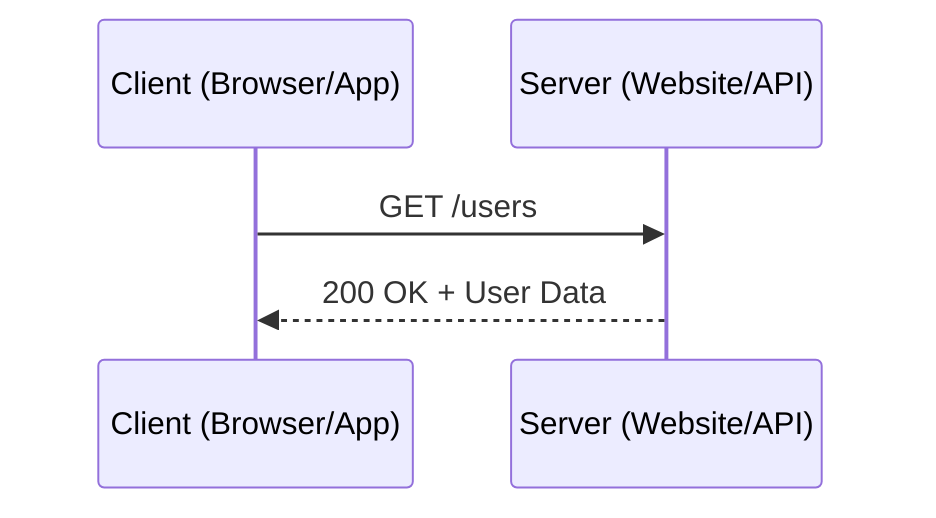

# API Fundamentals: REST, HTTP, and the Web

Welcome to **Part APIs: Building Modern APIs & Backends with Go**! 🚦🌐

APIs (Application Programming Interfaces) are the bridges and highways of the digital world. Imagine a city where every building is a different app or service—APIs are the roads, traffic lights, and intersections that let them communicate, share, and collaborate. In this section, we’ll demystify APIs, REST, and HTTP, using fun analogies, clear theory, and visual diagrams to make these concepts easy and memorable.

---

## What is an API? 🤔

Think of an API as a restaurant menu. When you visit a restaurant, you don’t go into the kitchen and cook your own food. Instead, you look at the menu (the API), choose what you want, and the kitchen (the server) prepares it for you. You don’t need to know how the food is made—you just need to know what you can order and how to ask for it.

- **API = Menu**: Lists what you can ask for.
- **Request = Your Order**: You tell the waiter what you want.
- **Response = Your Meal**: The kitchen prepares and delivers your food.

APIs let programs talk to each other in a standardized way, just like menus let customers order food without chaos.

---

### More Fun Analogies 🍔🎮🔌
- **Remote Control:** An API is like a TV remote—you don’t need to know how the TV works inside, just which buttons to press to get what you want.
- **Power Outlet:** Plug in any device (app) and as long as it fits the socket (API contract), it works—no need to know how the electricity is generated.
- **Vending Machine:** You press a button (make a request), and the machine (API) gives you a snack (response)—no need to see the inner workings!

---

### Key API Concepts
- **Endpoints:** Think of these as the different items on the menu, each with its own address (URL). For example, `/weather` or `/users/42`.
- **Data Formats:** APIs usually speak in common languages like JSON or XML—like agreeing to use English or Spanish to communicate.
- **API Contract:** The rules for what you can ask for and what you’ll get back. Like a menu that says “No substitutions!”

---

### Real-World API Examples 🌦️🗺️💳
- **Weather Apps:** Use APIs to fetch the latest forecast from a weather service.
- **Maps & Navigation:** Apps like Google Maps use APIs to get directions, traffic, and places.
- **Payments:** Online stores use payment APIs (like Stripe or PayPal) to process transactions securely.
- **Social Media:** Apps use APIs to post tweets, upload photos, or fetch your friends list.

---

### APIs Are Everywhere!
- **Smart Homes:** Your phone talks to your smart lights or thermostat via APIs.
- **IoT Devices:** Sensors, cameras, and gadgets all use APIs to send and receive data.
- **Automation:** Businesses connect different tools (like Slack, email, and databases) using APIs to automate workflows.

---

### Visual: API as a Bridge 🌉
> _Imagine a bridge connecting two islands (apps). The bridge (API) has clear rules: who can cross, what they can carry, and how to get to the other side._



APIs are the bridges that make the digital world work together!

---

## REST: The Waiter Who Follows the Rules 🍽️

Imagine REST as the most professional waiter in a high-end restaurant. This waiter follows strict rules to ensure every order is handled perfectly:
- **Consistency**: Every customer gets the same level of service.
- **Efficiency**: Orders are taken, processed, and delivered quickly.
- **Clarity**: The menu (API documentation) is easy to understand.

---

### REST Principles 🧾

REST (Representational State Transfer) is built on a few key principles:
- **Statelessness**: Each request is independent. The waiter doesn’t remember your previous orders; you must specify everything each time.
- **Resource Representation**: Data is represented as resources (e.g., `/users`, `/orders`). Each resource has a unique URL.
- **Uniform Interface**: The waiter uses standard methods (GET, POST, PUT, DELETE) to interact with resources.
- **Client-Server Architecture**: The client (you) and server (kitchen) are separate, allowing scalability.

---

### Mapping HTTP Methods to CRUD 🍴

RESTful APIs use HTTP methods to perform actions on resources:
- **GET**: Retrieve data ("Can I see the dessert menu?").
- **POST**: Create new data ("I’d like to order a pizza.").
- **PUT**: Update existing data ("Change my order to a salad.").
- **DELETE**: Remove data ("Cancel my order.").

These methods map directly to CRUD operations:
- **Create**: POST
- **Read**: GET
- **Update**: PUT
- **Delete**: DELETE

---

### Real-World Examples 🌍

1. **E-commerce**:
   - **GET** `/products`: Fetch a list of products.
   - **POST** `/cart`: Add an item to the shopping cart.
   - **PUT** `/cart/42`: Update the quantity of an item.
   - **DELETE** `/cart/42`: Remove an item from the cart.

2. **Social Media**:
   - **GET** `/posts`: Fetch recent posts.
   - **POST** `/posts`: Create a new post.
   - **PUT** `/posts/123`: Edit a post.
   - **DELETE** `/posts/123`: Delete a post.

---

### Sample RESTful API Request 🍕

Here’s an example of ordering pizza using REST:

#### Request:
```http
POST /order HTTP/1.1
Host: pizzashop.com
Content-Type: application/json

{
  "topping": "pepperoni",
  "size": "large"
}
```

#### Response:
```http
HTTP/1.1 201 Created
Content-Type: application/json

{
  "orderId": 123,
  "status": "baking"
}
```

---

### Visualizing RESTful APIs 🖼️



---

### Why REST Matters 🚀

RESTful APIs are popular because they:
- **Simplify Development**: Standard methods make APIs easy to design and use.
- **Enhance Scalability**: Statelessness allows servers to handle more requests.
- **Improve Interoperability**: Uniform interfaces work across different platforms.

By mastering REST, you’ll be able to design APIs that are efficient, scalable, and easy to use. Let’s keep building!

---

## HTTP: The Language of the Web 🌍

HTTP (HyperText Transfer Protocol) is the backbone of the web, enabling communication between clients (like browsers or apps) and servers. It’s the universal language that ensures data flows smoothly across the internet. Let’s dive deeper into its components and why it’s so essential.

---

### What is HTTP? 🤔

Imagine HTTP as the postal service of the internet. It delivers messages (requests and responses) between clients and servers, ensuring they follow a standardized format. Here’s how it works:

- **Client**: The sender (e.g., your browser or app).
- **Server**: The receiver (e.g., a website or API).
- **Request**: The message sent by the client (e.g., “I want the homepage!”).
- **Response**: The reply from the server (e.g., “Here’s the homepage!”).

---

### Key Components of HTTP 📦

1. **URLs (Uniform Resource Locators)**:
   - Think of URLs as addresses on the web. They tell the client where to send the request.
   - Example: `https://example.com/users/42`.

2. **Headers**:
   - Headers are like instructions attached to a package. They provide metadata about the request or response.
   - Example: `Content-Type: application/json` tells the server the data format.

3. **Body**:
   - The body contains the main content of the request or response.
   - Example: A JSON object with user data.

4. **Methods**:
   - HTTP methods define the action to be performed:
     - **GET**: Retrieve data.
     - **POST**: Create new data.
     - **PUT**: Update existing data.
     - **DELETE**: Remove data.

---

### How HTTP Works 🚦

1. **Request**:
   - The client sends an HTTP request to the server.
   - Example:
     ```http
     GET /users HTTP/1.1
     Host: example.com
     Content-Type: application/json
     ```

2. **Response**:
   - The server processes the request and sends back an HTTP response.
   - Example:
     ```http
     HTTP/1.1 200 OK
     Content-Type: application/json

     {
       "id": 42,
       "name": "John Doe"
     }
     ```

---

### HTTP Status Codes 📊

HTTP responses include status codes to indicate the result of the request:

- **200 OK**: Success!
- **404 Not Found**: The requested resource doesn’t exist.
- **500 Internal Server Error**: Something went wrong on the server.
- **301 Moved Permanently**: The resource has a new URL.

---

### HTTP Versions 🌐

1. **HTTP/1.1**:
   - The most widely used version.
   - Supports persistent connections and chunked transfers.

2. **HTTP/2**:
   - Faster and more efficient.
   - Uses multiplexing to send multiple requests over a single connection.

3. **HTTP/3**:
   - The latest version.
   - Built on QUIC, a protocol designed for speed and reliability.

---

### Why HTTP Matters 🧠

HTTP is the foundation of the web. Without it, browsers couldn’t fetch websites, apps couldn’t call APIs, and the internet as we know it wouldn’t exist. It’s simple, powerful, and universally understood.

---

### Fun Analogies 🎨

- **Postal Service**: HTTP is like sending letters—each request is a letter, and the response is the reply.
- **Waiter**: The client places an order (request), and the server delivers the dish (response).
- **Bridge**: HTTP connects clients and servers, ensuring data flows smoothly.

---

### Visualizing HTTP: A Sequence Diagram 📈



HTTP is the universal translator of the web, ensuring clients and servers can communicate seamlessly. Let’s explore how Go makes working with HTTP even easier!
