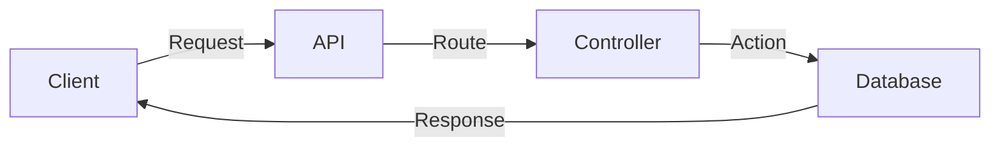

# Designing Clean URLs, Query Params, and Routing 🛣️

Welcome to the art of designing clean and intuitive URLs! Imagine URLs as the street addresses of the web—they guide users and programs to the right destination. In this section, we’ll explore how to craft URLs that are easy to read, understand, and maintain, while ensuring your API is both functional and elegant.

---

## Why Clean URLs Matter 🌟

Think of URLs as the signs on a highway. Clear, concise signs help drivers (users and developers) navigate without confusion. Clean URLs:
- **Improve Usability**: Users can easily guess what a URL does.
- **Enhance SEO**: Search engines love readable URLs.
- **Simplify Debugging**: Developers can quickly identify issues.

---

## Principles of Clean URL Design 📏

1. **Use Meaningful Names**: Avoid cryptic codes; use descriptive words.
   - Bad: `/p123`
   - Good: `/products/123`

2. **Keep It Short**: Long URLs are hard to read and share.
   - Bad: `/products/123/details/specifications`
   - Good: `/products/123`

3. **Avoid Special Characters**: Stick to alphanumeric characters and dashes.
   - Bad: `/products/123?name=phone&color=red`
   - Good: `/products/123/phone/red`

4. **Use Hierarchical Structure**: Organize URLs logically.
   - Example: `/users/42/orders/123`

---

## Query Parameters: The Extra Details 📝

Query parameters are like the fine print on a contract—they add extra details without cluttering the main message. Use them for:
- **Filters**: `/products?category=electronics`
- **Sorting**: `/products?sort=price`
- **Pagination**: `/products?page=2`

---

## Routing: The GPS of Your API 🗺️

Routing is the process of mapping URLs to specific actions in your API. Think of it as the GPS that directs requests to the right destination. Here’s how it works:

1. **Static Routes**: Fixed paths for specific resources.
   - Example: `/users/42`

2. **Dynamic Routes**: Flexible paths with placeholders.
   - Example: `/users/{id}`

3. **Catch-All Routes**: Handle unexpected paths.
   - Example: `/404`

---

## Real-World Examples 🌍

1. **E-commerce**:
   - `/products`: List all products.
   - `/products/123`: View details of product 123.
   - `/products?category=electronics`: Filter by category.

2. **Social Media**:
   - `/users/42`: View profile of user 42.
   - `/users/42/posts`: View posts by user 42.
   - `/users/42/posts?sort=date`: Sort posts by date.

---

## Visualizing Routing 🖼️

---

## Best Practices for Clean URLs 🛠️

- **Consistency**: Stick to a naming convention.
- **Readability**: Make URLs easy to understand.
- **Scalability**: Design URLs that can grow with your API.

By mastering clean URLs, query parameters, and routing, you’ll create APIs that are a joy to use and maintain. Let’s get started! 🚀
