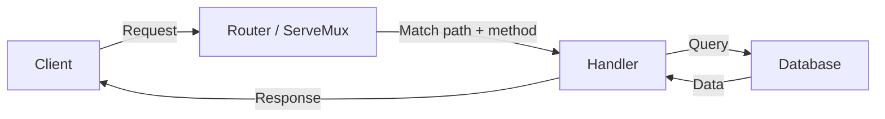

# Designing Clean URLs, Query Params, and Routing

Welcome to the art of designing clean and intuitive URLs. Think of URLs as the street addresses of the web: they guide users and programs to the right destination. A URL is also part of your public API contract — once clients start calling `/v1/orders/42`, that shape is effectively frozen, so it pays to get it right early. In this section, we'll explore how to craft URLs that are easy to read, understand, and maintain, and then build a real router in Go that handles both clean paths and query parameters.

---

## Why Clean URLs Matter

Think of URLs as the signs on a highway. Clear, concise signs help drivers — users and developers alike — navigate without confusion. Clean URLs:

- **Improve usability**: Users and other developers can guess what a URL does before ever reading the docs.
- **Enhance SEO**: Search engines rank readable, structured URLs higher than opaque ones.
- **Simplify debugging**: When a log line shows `GET /users/42/orders/17`, you immediately know what was being requested, without cross-referencing an ID table.
- **Improve caching**: Proxies, CDNs, and browsers cache based on the URL. Stable, predictable paths cache better than URLs stuffed with session state or inconsistent parameter ordering.

---

## Principles of Clean URL Design

1. **Use meaningful names.** Avoid cryptic codes; use descriptive nouns.
   - Bad: `/p123`
   - Good: `/products/123`

2. **Keep it short.** Long URLs are hard to read, share, and type.
   - Bad: `/products/123/details/specifications/technical`
   - Good: `/products/123`

3. **Use nouns, not verbs.** The HTTP method already expresses the action, so the path shouldn't repeat it.
   - Bad: `/getProduct?id=123`, `/deleteProduct/123`
   - Good: `GET /products/123`, `DELETE /products/123`

4. **Use a hierarchical structure for ownership.** Nest a resource under its parent when it can't exist without it.
   - Example: `/users/42/orders/123` reads as "order 123 belonging to user 42."

5. **Be consistent about casing and trailing slashes.** Pick lowercase, hyphen-separated segments (`/order-items`, not `/orderItems` or `/order_items`), and decide once whether trailing slashes are allowed — then apply that rule everywhere.

<DeepDive title="Singular or plural resource names?">Most REST APIs settle on plural nouns for collections — `/users`, `/products` — because a collection endpoint naturally returns many items, and the singular form is just the collection with an ID appended: `/users/42`. Pick one convention for the whole API and never mix them; switching between `/user/42` and `/products/123` inside the same API is one of the most common sources of client confusion.</DeepDive>

---

## Query Parameters: The Extra Details

Query parameters are the fine print attached to a URL — they refine *how* you want to view a resource without changing *what* resource you're asking for. The rule of thumb: **path segments identify a resource, query parameters modify a view of a collection.**

Typical uses:

- **Filtering**: `/products?category=electronics`
- **Sorting**: `/products?sort=price` or, for multiple fields, `/products?sort=-price,name` (a leading `-` means descending).
- **Pagination**: `/products?page=2&limit=20`, or cursor-based: `/products?cursor=eyJpZCI6NDJ9`.
- **Search**: `/products?q=wireless+mouse`.
- **Sparse fieldsets**: `/products?fields=id,name,price` to trim the response payload.

A single resource can combine several of these at once: `/products?category=electronics&sort=-price&page=1&limit=10`.

**A note on encoding.** Query strings can only safely contain a limited character set; spaces, `&`, `=`, and other reserved characters must be percent-encoded (a space becomes `%20` or `+`, `&` becomes `%26`). Never hand-build a query string with `fmt.Sprintf` — use `net/url` so encoding is handled correctly:

```go
values := url.Values{}
values.Set("category", "electronics")
values.Set("sort", "-price")
values.Set("q", "wireless mouse")

full := "/products?" + values.Encode()
// full == "/products?category=electronics&q=wireless+mouse&sort=-price"
```

`url.Values` is just a `map[string][]string`, so it also gives you repeated keys for free (`tag=go&tag=api`) when a filter accepts multiple values.

---

## Routing: The GPS of Your API

Routing maps an incoming URL — and, in a REST API, an HTTP method — to the code that should handle it. There are three shapes of route you'll use over and over:

1. **Static routes**: a fixed path for a specific action. Example: `/health`.
2. **Dynamic routes**: a path with a placeholder that captures part of the URL as data. Example: `/users/{id}`.
3. **Catch-all routes**: a fallback for anything that doesn't match, usually a 404 handler.

### Routing in Go with net/http

Since Go 1.22, the standard library's `http.ServeMux` understands both HTTP methods and wildcard path segments natively, which removes most of the historical need to reach for a third-party router just to get clean paths. A pattern looks like `"GET /products/{id}"`, and the captured segment is read with `r.PathValue("id")`.

<Warning title="Go version matters">Method-aware patterns and `{wildcard}` segments in `http.ServeMux` were added in Go 1.22 (released February 2024). On older Go versions, `ServeMux` only does prefix matching, and you'd need a package like `gorilla/mux` or `go-chi/chi` to get this behavior.</Warning>

Here's a small, complete example that ties routing and query parameters together — a `/products` endpoint that lists and filters products, and a `/products/{id}` endpoint that fetches one:

```go
package main

import (
	"encoding/json"
	"log"
	"net/http"
	"strconv"
)

type Product struct {
	ID       int     `json:"id"`
	Name     string  `json:"name"`
	Category string  `json:"category"`
	Price    float64 `json:"price"`
}

var catalog = []Product{
	{1, "Keyboard", "electronics", 49.99},
	{2, "Desk Lamp", "home", 19.99},
	{3, "Wireless Mouse", "electronics", 24.99},
}

func listProducts(w http.ResponseWriter, r *http.Request) {
	query := r.URL.Query()
	category := query.Get("category")

	page, _ := strconv.Atoi(query.Get("page"))
	if page < 1 {
		page = 1
	}
	limit, _ := strconv.Atoi(query.Get("limit"))
	if limit <= 0 || limit > 50 {
		limit = 10
	}

	var filtered []Product
	for _, p := range catalog {
		if category == "" || p.Category == category {
			filtered = append(filtered, p)
		}
	}

	start := (page - 1) * limit
	if start > len(filtered) {
		start = len(filtered)
	}
	end := start + limit
	if end > len(filtered) {
		end = len(filtered)
	}

	w.Header().Set("Content-Type", "application/json")
	json.NewEncoder(w).Encode(filtered[start:end])
}

func getProduct(w http.ResponseWriter, r *http.Request) {
	id, err := strconv.Atoi(r.PathValue("id"))
	if err != nil {
		http.Error(w, "invalid product id", http.StatusBadRequest)
		return
	}

	for _, p := range catalog {
		if p.ID == id {
			w.Header().Set("Content-Type", "application/json")
			json.NewEncoder(w).Encode(p)
			return
		}
	}
	http.Error(w, "product not found", http.StatusNotFound)
}

func main() {
	mux := http.NewServeMux()
	mux.HandleFunc("GET /products", listProducts)
	mux.HandleFunc("GET /products/{id}", getProduct)

	log.Println("listening on :8080")
	log.Fatal(http.ListenAndServe(":8080", mux))
}
```

A request like `GET /products?category=electronics&page=1&limit=10` filters and paginates in one shot, while `GET /products/2` uses the dynamic `{id}` segment to fetch a single resource. Notice how the path never encodes filtering or pagination — those live entirely in the query string, exactly as the earlier rule of thumb suggests.

For larger APIs — nested route groups, shared middleware chains, regex constraints on path segments — reaching for a router like `chi` or `gorilla/mux` still pays off. We'll use two different high-level frameworks, Gin and Fiber, for exactly that kind of ergonomics in later chapters.

---

## Real-World Examples

1. **E-commerce**:
   - `GET /products` — list all products.
   - `GET /products/123` — view details of product 123.
   - `GET /products?category=electronics` — filter by category.

2. **Social media**:
   - `GET /users/42` — view the profile of user 42.
   - `GET /users/42/posts` — view posts by user 42.
   - `GET /users/42/posts?sort=-date` — sort those posts, newest first.

3. **Blog or CMS**:
   - `GET /articles/2026/designing-clean-urls` — a human-readable, date-and-slug path for a single article.
   - `GET /articles?tag=go&page=2` — filter and paginate the article list.

---

## Visualizing Routing



---

## Best Practices for Clean URLs

- **Consistency**: pick one naming convention (plural nouns, lowercase, hyphens) and apply it everywhere.
- **Readability**: a URL should be understandable without reading the documentation.
- **Scalability**: design paths that can grow — adding `/users/42/orders/123/items` should feel natural, not bolted on.
- **Stability**: once a path is public, avoid changing it; introduce a new version instead of breaking existing clients (we'll cover versioning strategies in depth in a later chapter).
- **Limit nesting depth**: two or three levels is usually the practical ceiling before a URL becomes unwieldy — beyond that, promote a nested resource to its own top-level path with a filter, e.g. `/order-items?order_id=123` instead of `/users/42/orders/123/items/7/history`.

By mastering clean URLs, query parameters, and routing, you'll design APIs that are a joy to use and maintain — and you now have a working `net/http` router to prove it. Next, we'll look at how to shape the data flowing through those routes with JSON and XML serialization.
