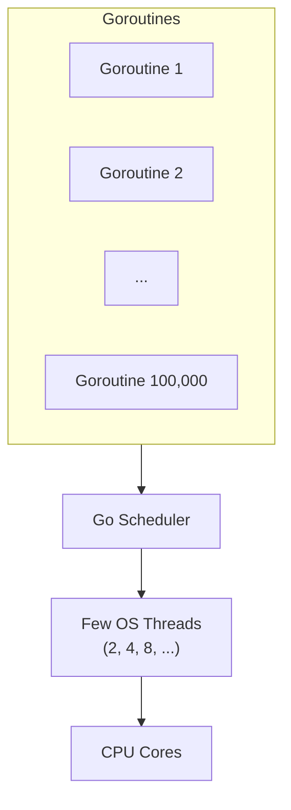
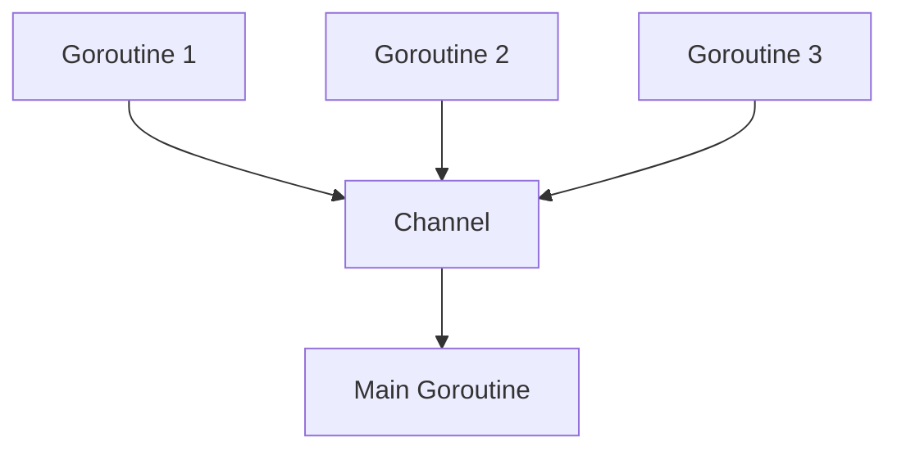
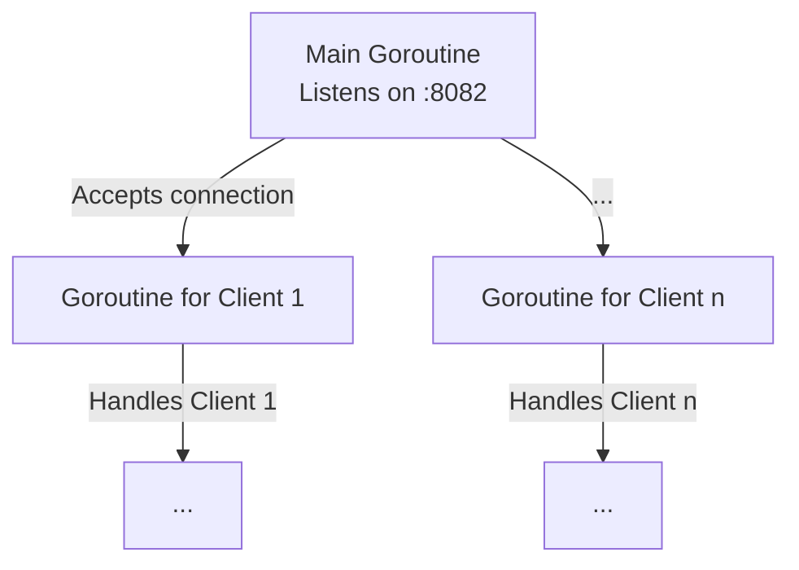
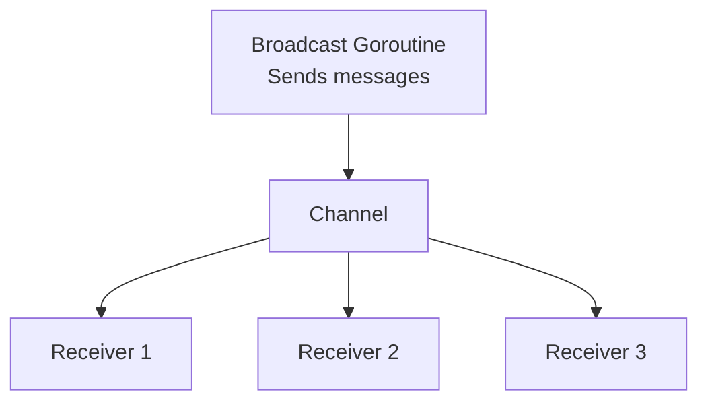
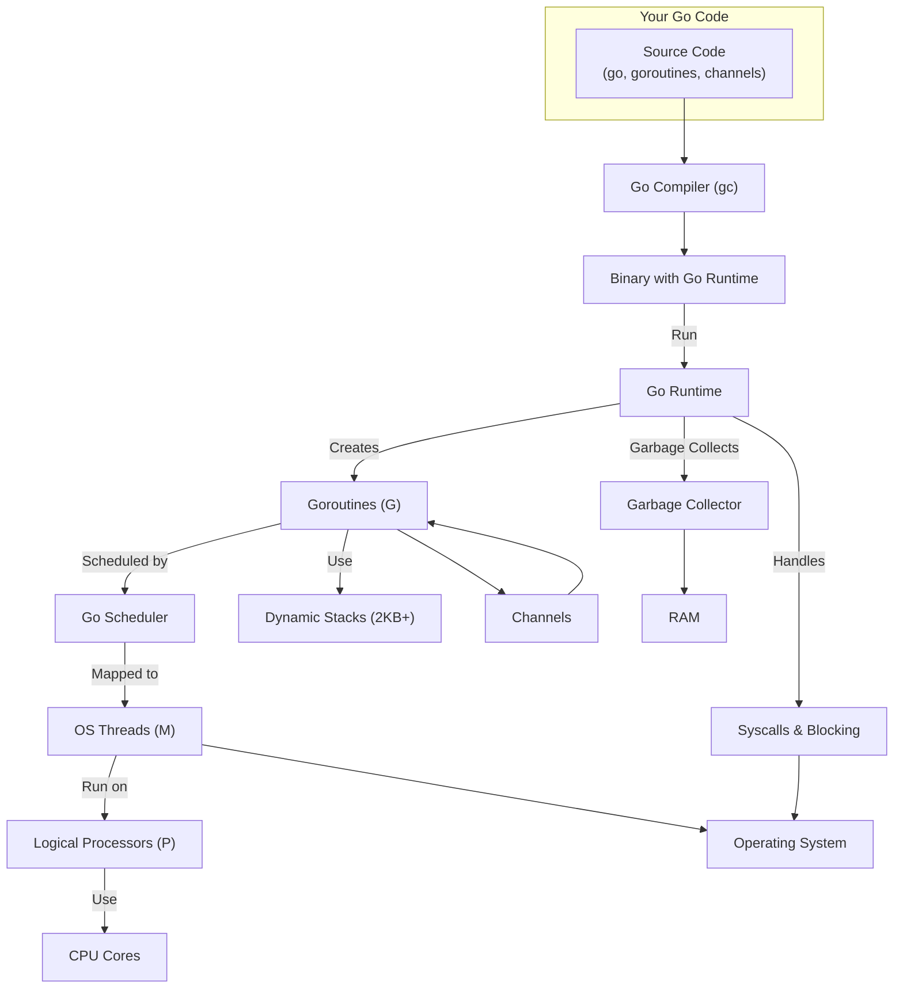

# Concurrency in Networking: Theory and Go Implementation 🧵

> "Imagine a busy restaurant kitchen: chefs (goroutines) work on different dishes at the same time, waiters (channels) deliver orders and plates, and the manager (main function) keeps everything running smoothly. Welcome to the world of concurrency in Go!"

---

## 🚦 Why Concurrency Matters in Networking

Networking is all about handling many things at once: multiple clients, simultaneous requests, and real-time data. Without concurrency, your server would be like a single cashier at a supermarket—everyone waits in line, and things get slow fast!

- **Analogy:** Concurrency is like having many hands to juggle multiple balls at once.
- **In Go:** Goroutines and channels make concurrency easy, safe, and fun.

---

## 🧠 What is Concurrency? What is Parallelism?

- **Concurrency:** Doing many things at once (not necessarily at the same time, but making progress on all).
- **Parallelism:** Actually running things at the same time (on multiple CPU cores).
- **Go’s Superpower:** Goroutines are so lightweight, you can have thousands running without breaking a sweat!

**Fun Fact:**
- Go’s concurrency model is inspired by Tony Hoare’s CSP (Communicating Sequential Processes).

---

## 🧵 Goroutines: Lightweight Threads

- **What are they?** Functions that run independently, started with the `go` keyword.
- **How lightweight?** Each goroutine uses only a few KB of memory.
- **Why use them?** Handle many clients, background tasks, or timers without blocking your main program.

**Example:**

```go
package main
import (
    "fmt"
    "time"
)

func sayHello(name string) {
    fmt.Printf("Hello, %s!\n", name)
}

func main() {
    go sayHello("Alice") // Runs in a new goroutine
    go sayHello("Bob")
    time.Sleep(1 * time.Second) // Wait for goroutines to finish
    fmt.Println("Done!")
}
```

[Ejercicio: Goroutines Básicas](../../exercises/part2/08-goroutines-basic/main.go)

---

## 📬 Channels: Safe Communication Between Goroutines

- **What are they?** Typed pipes for sending data between goroutines.
- **Why use them?** Avoid race conditions and share data safely.

**Example:**

```go
package main
import "fmt"

func main() {
    ch := make(chan string) // Create a channel
    go func() {
        ch <- "Hello from goroutine!" // Send data
    }()
    msg := <-ch // Receive data
    fmt.Println(msg)
}
```

[Ejercicio: Canales Básicos](../../exercises/part2/08-channels-basic/main.go)

---

## 🛠️ Go in Action: Concurrent TCP Server

Let’s build a TCP server that handles each client in a separate goroutine.

```go
package main
import (
    "fmt"
    "net"
)

func handleConn(c net.Conn) {
    fmt.Fprintln(c, "Welcome to the concurrent server!")
    c.Close()
}

func main() {
    ln, _ := net.Listen("tcp", ":8082")
    fmt.Println("Server listening on :8082")
    for {
        conn, _ := ln.Accept()
        go handleConn(conn) // Each client handled concurrently
    }
}
```

[Ejercicio: Concurrent TCP Server](../../exercises/part2/08-tcp-concurrent-server/main.go)

---

## 🛠️ Go in Action: Channel-Based Message Broadcast

A simple example where one goroutine sends messages to many receivers using channels.

```go
package main
import (
    "fmt"
    "time"
)

func broadcaster(ch chan string) {
    for i := 1; i <= 3; i++ {
        ch <- fmt.Sprintf("Message %d", i)
        time.Sleep(500 * time.Millisecond)
    }
    close(ch)
}

func main() {
    ch := make(chan string)
    go broadcaster(ch)
    for msg := range ch {
        fmt.Println("Received:", msg)
    }
}
```

[Ejercicio: Channel Broadcast](../../exercises/part2/08-channel-broadcast/main.go)

---

## 🧩 How Go Makes Concurrency Safe and Easy

- **Scheduler:** Go’s runtime schedules goroutines efficiently across CPU cores.
- **No manual threads:** No need to manage OS threads or locks for most cases.
- **Race Detector:** Run `go run -race` to catch data races.
- **Channels:** Make communication safe and explicit.
- **Select Statement:** Wait on multiple channels at once—like a switchboard for goroutines.

**Example:**

```go
select {
case msg := <-ch1:
    fmt.Println("Received from ch1:", msg)
case msg := <-ch2:
    fmt.Println("Received from ch2:", msg)
default:
    fmt.Println("No messages yet!")
}
```

[Ejercicio: Select Statement](../../exercises/part2/08-select-statement/main.go)

---

## 🧪 Go in Action: Goroutine Stress Test

Can you really launch 100,000 goroutines in Go? Yes! Here’s an exercise to try it and understand why it works:

```go
package main
import (
    "fmt"
    "sync"
)

func main() {
    var wg sync.WaitGroup
    count := 100000
    wg.Add(count)

    for i := 0; i < count; i++ {
        go func(n int) {
            defer wg.Done()
            if n == 0 {
                fmt.Println("First goroutine running!")
            }
        }(i)
    }

    wg.Wait()
    fmt.Println("All goroutines finished!")
}
```

[Exercise: Goroutine Stress Test](../../exercises/part2/08-goroutine-stress/main.go)

**Why can Go handle so many goroutines?**
- **Lightweight:** Each goroutine uses only a few KB of memory (not megabytes like OS threads).
- **Dynamic stack:** Each goroutine’s stack grows and shrinks as needed, starting very small.
- **Own scheduler:** Go has a runtime scheduler that multiplexes goroutines over a few OS threads (M:N model).
- **Non-blocking:** If a goroutine waits (e.g., for I/O), the scheduler moves others to free threads.
- **Efficiency:** This allows Go to handle tens or hundreds of thousands of concurrent tasks without exhausting RAM or CPU.

**Visualization (Mermaid):**



**Fun fact:**
- Launching 100,000 OS threads in C/C++ would crash your machine. In Go, it’s just another day for the gopher!

---

## 🎨 Visual Summary



**Explanation:**
- Each goroutine can handle a different client or task.
- Channels act as safe, synchronized pipelines for data between goroutines.
- The main routine can coordinate, collect, or broadcast messages.

---

## 🖼️ TCP Server Concurrency Flow



**Explanation:**
- The main goroutine listens for new connections.
- For each new client, it spawns a new goroutine to handle communication.
- All clients are served concurrently, so no one waits in line!

---

## 🖼️ Channel Broadcast Flow



**Explanation:**
- The broadcaster goroutine sends messages into a channel.
- Multiple receivers can read from the channel, each in their own goroutine.
- This pattern is great for chat servers, notifications, or event systems.

---

## 🤩 Fun Facts & Go Memes
- Go’s mascot, the gopher, is often shown juggling or running—just like goroutines!
- The phrase "Don’t communicate by sharing memory; share memory by communicating" is a Go proverb.
- You can run 100,000+ goroutines on a modern laptop—try it!
- Channels are so central to Go, they have their own operator: `<-`.
- Go’s concurrency model is so admired, other languages have copied it (Rust, Elixir, etc.).

---

## 🧬 Deep Dive: How Go Handles Massive Concurrency Under the Hood

> "Let’s open the black box! What really happens when you launch 100,000 goroutines? How does Go orchestrate memory, CPU, OS threads, and scheduling to make it all possible?"

---

### 🏗️ The Go Concurrency Engine: Step by Step

1. **Source Code to Binary:**
   - You write Go code with `go` statements. The Go compiler (`gc`) translates this into machine code, embedding the Go runtime.
2. **Go Runtime:**
   - The runtime is a set of libraries and a scheduler that manage goroutines, memory, and OS threads.
3. **Goroutine Creation:**
   - Each `go` statement creates a new goroutine. Instead of an OS thread, it’s a tiny structure (a few KB stack, metadata) managed by Go.
4. **Dynamic Stack Management:**
   - Goroutines start with a small stack (2 KB). If a goroutine needs more, the runtime grows the stack automatically. When it’s done, the stack shrinks—saving RAM.
5. **M:N Scheduler:**
   - Go uses an M:N scheduler: M goroutines are multiplexed onto N OS threads. The runtime decides which goroutine runs on which thread, and when.
6. **Work Stealing:**
   - Each OS thread (called an "M") has a queue of goroutines. If one thread finishes its work, it can "steal" goroutines from another—keeping all CPUs busy.
7. **GOMAXPROCS:**
   - This environment variable (default: number of CPU cores) controls how many OS threads can run Go code simultaneously.
8. **Syscalls and Blocking:**
   - If a goroutine blocks on I/O (e.g., network, disk), the runtime parks it and runs another goroutine on the freed thread. No wasted CPU!
9. **Garbage Collector:**
   - Go’s garbage collector runs concurrently, cleaning up unused memory without stopping all goroutines.
10. **OS Integration:**
    - The runtime uses OS primitives (threads, signals, timers) but hides the complexity from you.

---

### 🖥️ Full System Diagram: Go Concurrency Pipeline



---

### 🧠 What Each Component Does

- **Go Compiler:** Translates your code into a binary, embedding the Go runtime.
- **Go Runtime:** The heart of Go’s concurrency—manages goroutines, scheduling, memory, and more.
- **Goroutines (G):** Lightweight, managed by Go, not the OS. Each has its own stack and metadata.
- **Scheduler:** Decides which goroutine runs where and when. Uses work stealing for efficiency.
- **OS Threads (M):** Real threads provided by the OS. Go maps many goroutines onto a few threads.
- **Logical Processors (P):** Internal Go concept—each P is assigned to an OS thread and schedules goroutines.
- **CPU Cores:** Where the actual computation happens.
- **Dynamic Stacks:** Goroutine stacks grow/shrink as needed, saving memory.
- **Garbage Collector:** Frees unused memory, runs concurrently with your code.
- **Syscalls & Blocking:** When a goroutine blocks, Go parks it and runs another—no wasted CPU.
- **Channels:** Safe, synchronized communication between goroutines.
- **RAM:** All goroutine stacks, heap, and runtime data live here.
- **Operating System:** Provides threads, timers, and low-level resources.

---

### 📝 Example: What Happens When You Run 100,000 Goroutines?

1. Your code calls `go myFunc(i)` 100,000 times.
2. The Go runtime allocates a tiny stack and metadata for each goroutine.
3. The scheduler assigns goroutines to available logical processors (P), which run on OS threads (M).
4. If a goroutine blocks (e.g., on a channel or I/O), the scheduler parks it and runs another.
5. The garbage collector reclaims memory as goroutines finish.
6. All this happens with minimal RAM and CPU overhead—no OS thread explosion!

---

### 🧩 Why is This So Powerful?
- You can write highly concurrent code without worrying about threads, locks, or memory.
- Go’s runtime does the heavy lifting: scheduling, memory, blocking, and cleanup.
- This model is why Go is used for high-performance servers, cloud systems, and real-time apps.

---

**Try it yourself:**
- Run the [Goroutine Stress Test](../../exercises/part2/08-goroutine-stress/main.go) and monitor your system’s RAM and CPU usage. You’ll see how efficient Go really is!

---

[Previous: Error Handling and Debugging](07-error-handling-and-debugging.md) | [Next: Context and Cancellation](09-context-and-cancellation.md)
