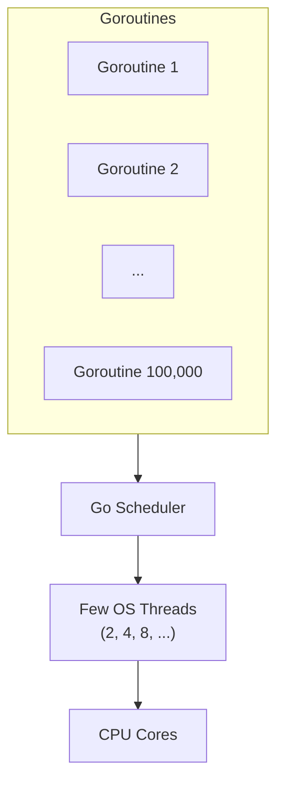
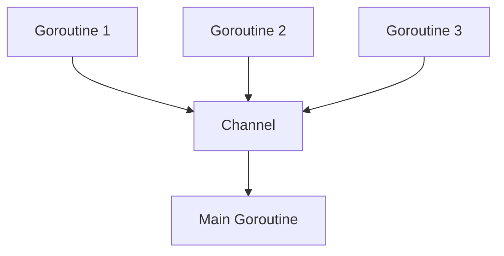
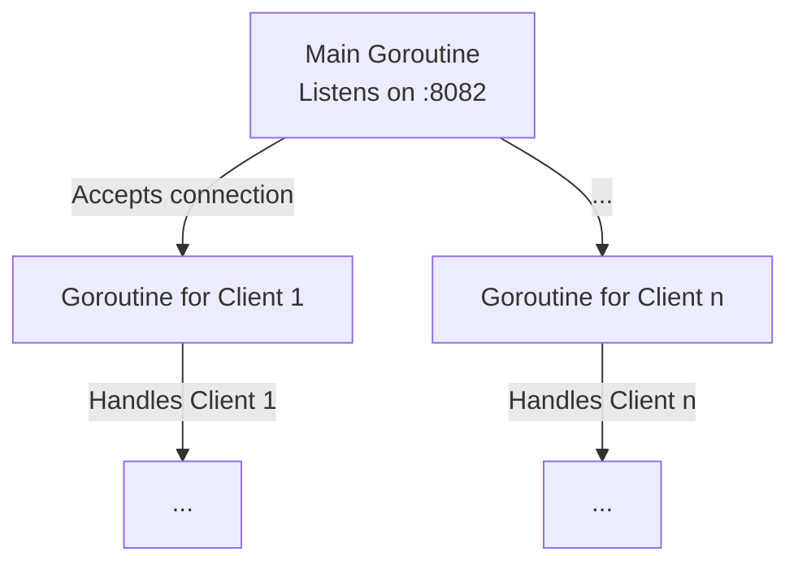
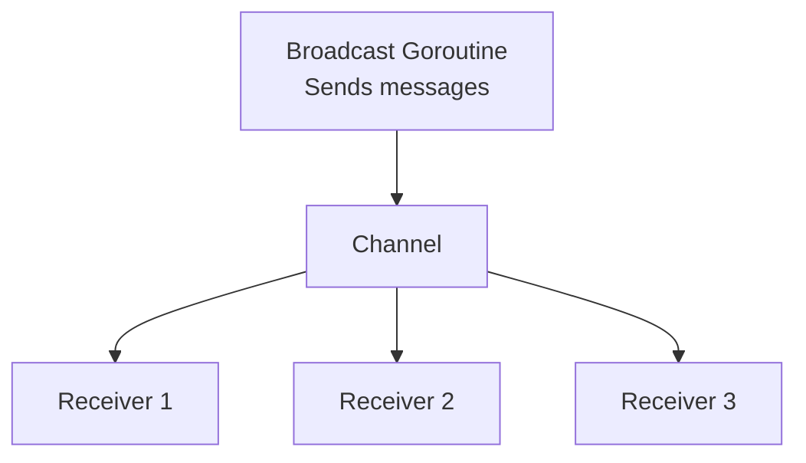
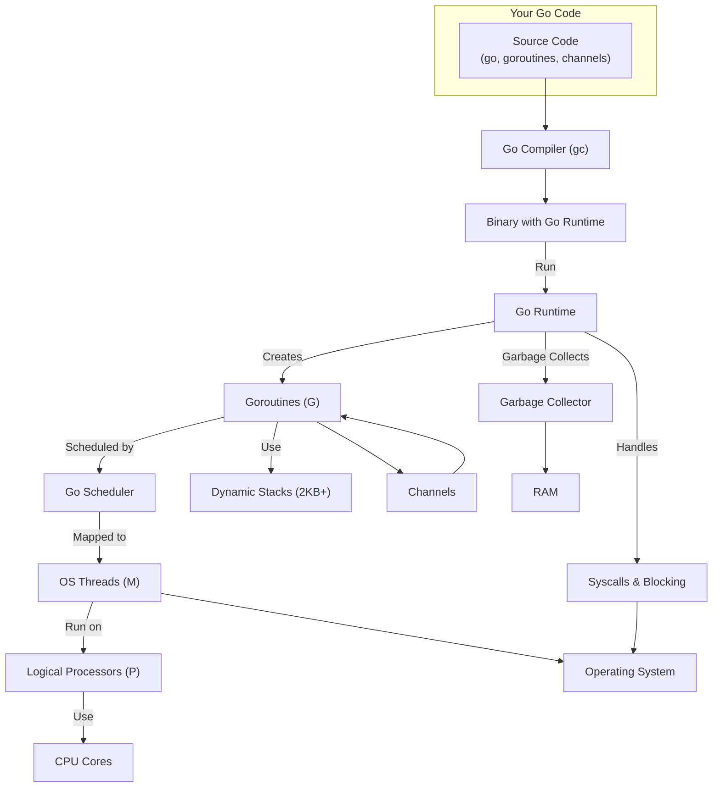
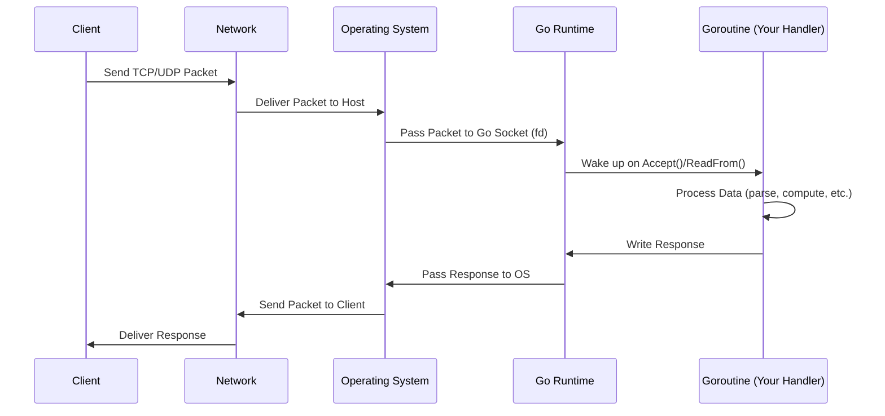

# Concurrency in Networking: Theory and Go Implementation

> "Imagine a busy restaurant kitchen: chefs (goroutines) work on different dishes at the same time, waiters (channels) deliver orders and plates, and the manager (main function) keeps everything running smoothly. Welcome to the world of concurrency in Go!"

---

## Why Concurrency Matters in Networking

Networking is all about handling many things at once: multiple clients, simultaneous requests, and real-time data. Without concurrency, your server would be like a single cashier at a supermarket—everyone waits in line, and things get slow fast!

- **Analogy:** Concurrency is like having many hands to juggle multiple balls at once.
- **In Go:** Goroutines and channels make concurrency easy, safe, and fun.

---

## What is Concurrency? What is Parallelism?

- **Concurrency:** Doing many things at once (not necessarily at the same time, but making progress on all).
- **Parallelism:** Actually running things at the same time (on multiple CPU cores).
- **Go’s Superpower:** Goroutines are so lightweight, you can have thousands running without breaking a sweat!

**Fun Fact:**
- Go’s concurrency model is inspired by Tony Hoare’s CSP (Communicating Sequential Processes).

---

## Goroutines: Lightweight Threads

- **What are they?** Functions that run independently, started with the `go` keyword.
- **How lightweight?** Each goroutine uses only a few KB of memory.
- **Why use them?** Handle many clients, background tasks, or timers without blocking your main program.

**Example:**

```go
package main
import (
    "fmt"
    "time"
)

func sayHello(name string) {
    fmt.Printf("Hello, %s!\n", name)
}

func main() {
    go sayHello("Alice") // Runs in a new goroutine
    go sayHello("Bob")
    time.Sleep(1 * time.Second) // Wait for goroutines to finish
    fmt.Println("Done!")
}
```

[Exercise: Goroutines Basics](../../exercises/part2/08-goroutines-basic/main.go)

---

## Channels: Safe Communication Between Goroutines

- **What are they?** Typed pipes for sending data between goroutines.
- **Why use them?** Avoid race conditions and share data safely.

**Example:**

```go
package main
import "fmt"

func main() {
    ch := make(chan string) // Create a channel
    go func() {
        ch <- "Hello from goroutine!" // Send data
    }()
    msg := <-ch // Receive data
    fmt.Println(msg)
}
```

[Exercise: Channels Basics](../../exercises/part2/08-channels-basic/main.go)

<DeepDive title="Buffered vs. Unbuffered Channels">The channel above, `make(chan string)`, is **unbuffered**: a send blocks until another goroutine is ready to receive, so the two sides briefly synchronize on the handoff. A **buffered** channel, `make(chan string, 3)`, lets up to 3 sends complete with no receiver present — the sender only blocks once the buffer fills up. Use unbuffered channels when you need a guarantee that the value was actually received; use buffered channels to absorb bursts of work between producers and consumers, like a small queue.</DeepDive>

---

## Go in Action: Concurrent TCP Server

Let’s build a TCP server that handles each client in a separate goroutine.

```go
package main
import (
    "fmt"
    "net"
)

func handleConn(c net.Conn) {
    fmt.Fprintln(c, "Welcome to the concurrent server!")
    c.Close()
}

func main() {
    ln, _ := net.Listen("tcp", ":8082")
    fmt.Println("Server listening on :8082")
    for {
        conn, _ := ln.Accept()
        go handleConn(conn) // Each client handled concurrently
    }
}
```

[Exercise: Concurrent TCP Server](../../exercises/part2/08-tcp-concurrent-server/main.go)

---

## Go in Action: A Bounded Worker Pool for Connections

The accept loop above spawns one goroutine per connection with no upper
limit — fine under normal load, risky under a connection flood (a burst
of new clients, or a misbehaving load balancer retrying too
aggressively). A **worker pool** bounds concurrency instead: a fixed
number of worker goroutines pull connections off a channel, so the
number of connections handled *at once* never exceeds the pool size, no
matter how many more are waiting to be accepted.

```go
package main

import (
    "fmt"
    "log"
    "net"
)

const numWorkers = 20

func handle(conn net.Conn) {
    defer conn.Close()
    fmt.Fprintln(conn, "handled by the pool")
}

func worker(id int, jobs <-chan net.Conn) {
    for conn := range jobs { // exits once jobs is closed and drained
        handle(conn)
    }
    fmt.Println("worker", id, "shutting down")
}

func main() {
    ln, err := net.Listen("tcp", ":9001")
    if err != nil {
        log.Fatal(err)
    }
    defer ln.Close()

    jobs := make(chan net.Conn, numWorkers)
    for i := 1; i <= numWorkers; i++ {
        go worker(i, jobs)
    }

    for {
        conn, err := ln.Accept()
        if err != nil {
            log.Println("accept error:", err)
            continue
        }
        jobs <- conn // blocks once every worker is busy and the buffer is full
    }
}
```

With `numWorkers` fixed at 20 and a buffered channel of the same size,
at most 20 connections are handled concurrently, and at most 20 more sit
in the buffer waiting for a free worker. Past that, `jobs <- conn`
simply blocks, which in turn makes `Accept()` wait before pulling the
next connection off the OS's own backlog queue — backpressure instead of
an unbounded pile of live goroutines.

<Warning title="A shared results map without a mutex will crash your server">It's common for worker handlers to record something per connection — a hit count, a session, a last-seen timestamp — in a `map[string]int` or similar declared outside the workers and closed over by all of them. Reading and writing that map concurrently from multiple worker goroutines with no `sync.Mutex` isn't a subtle bug: Go's runtime actively detects it and crashes the whole process with `fatal error: concurrent map read and map write`, often under nothing more than moderate load. Guard any map shared across goroutines with a `sync.Mutex` (or `sync.RWMutex` if reads dominate), or use `sync.Map` if the access pattern fits.</Warning>

---

## Go in Action: Channel-Based Message Broadcast

A simple example where one goroutine sends messages to many receivers using channels.

```go
package main
import (
    "fmt"
    "time"
)

func broadcaster(ch chan string) {
    for i := 1; i <= 3; i++ {
        ch <- fmt.Sprintf("Message %d", i)
        time.Sleep(500 * time.Millisecond)
    }
    close(ch)
}

func main() {
    ch := make(chan string)
    go broadcaster(ch)
    for msg := range ch {
        fmt.Println("Received:", msg)
    }
}
```

[Exercise: Channel Broadcast](../../exercises/part2/08-channel-broadcast/main.go)

<Warning title="Closed and Nil Channels Are Not the Same as Empty">Sending on a **closed** channel panics immediately with `send on closed channel`, even though receiving from it keeps returning the zero value forever — that asymmetry is why only the sender should ever call `close`. A **nil** channel (a `chan T` left at its zero value, never initialized with `make`) blocks forever on both send and receive; a `select` with a nil-channel case simply never picks it, which is a handy trick to "disable" a case at runtime.</Warning>

---

## How Go Makes Concurrency Safe and Easy

- **Scheduler:** Go’s runtime schedules goroutines efficiently across CPU cores.
- **No manual threads:** No need to manage OS threads or locks for most cases.
- **Race Detector:** Run `go run -race` to catch data races.
- **Channels:** Make communication safe and explicit.
- **Select Statement:** Wait on multiple channels at once—like a switchboard for goroutines.

**Example:**

```go
select {
case msg := <-ch1:
    fmt.Println("Received from ch1:", msg)
case msg := <-ch2:
    fmt.Println("Received from ch2:", msg)
default:
    fmt.Println("No messages yet!")
}
```

[Exercise: Select Statement](../../exercises/part2/08-select-statement/main.go)

---

## Go in Action: Goroutine Stress Test

Can you really launch 100,000 goroutines in Go? Yes! Here’s an exercise to try it and understand why it works:

```go
package main
import (
    "fmt"
    "sync"
)

func main() {
    var wg sync.WaitGroup
    count := 100000
    wg.Add(count)

    for i := 0; i < count; i++ {
        go func(n int) {
            defer wg.Done()
            if n == 0 {
                fmt.Println("First goroutine running!")
            }
        }(i)
    }

    wg.Wait()
    fmt.Println("All goroutines finished!")
}
```

[Exercise: Goroutine Stress Test](../../exercises/part2/08-goroutine-stress/main.go)

**Why can Go handle so many goroutines?**
- **Lightweight:** Each goroutine uses only a few KB of memory (not megabytes like OS threads).
- **Dynamic stack:** Each goroutine’s stack grows and shrinks as needed, starting very small.
- **Own scheduler:** Go has a runtime scheduler that multiplexes goroutines over a few OS threads (M:N model).
- **Non-blocking:** If a goroutine waits (e.g., for I/O), the scheduler moves others to free threads.
- **Efficiency:** This allows Go to handle tens or hundreds of thousands of concurrent tasks without exhausting RAM or CPU.

**Visualization (Mermaid):**



**Fun fact:**
- Launching 100,000 OS threads in C/C++ would crash your machine. In Go, it’s just another day for the gopher!

---

## Visual Summary



**Explanation:**
- Each goroutine can handle a different client or task.
- Channels act as safe, synchronized pipelines for data between goroutines.
- The main routine can coordinate, collect, or broadcast messages.

---

## TCP Server Concurrency Flow



**Explanation:**
- The main goroutine listens for new connections.
- For each new client, it spawns a new goroutine to handle communication.
- All clients are served concurrently, so no one waits in line!

---

## Channel Broadcast Flow



**Explanation:**
- The broadcaster goroutine sends messages into a channel.
- Multiple receivers can read from the channel, each in their own goroutine.
- This pattern is great for chat servers, notifications, or event systems.

---

## Deep Dive: How Go Handles Massive Concurrency Under the Hood

> "Let’s open the black box! What really happens when you launch 100,000 goroutines? How does Go orchestrate memory, CPU, OS threads, and scheduling to make it all possible?"

---

### The Go Concurrency Engine: Step by Step

1. **Source Code to Binary:**
   - You write Go code with `go` statements. The Go compiler (`gc`) translates this into machine code, embedding the Go runtime.
2. **Go Runtime:**
   - The runtime is a set of libraries and a scheduler that manage goroutines, memory, and OS threads.
3. **Goroutine Creation:**
   - Each `go` statement creates a new goroutine. Instead of an OS thread, it’s a tiny structure (a few KB stack, metadata) managed by Go.
4. **Dynamic Stack Management:**
   - Goroutines start with a small stack (2 KB). If a goroutine needs more, the runtime grows the stack automatically. When it’s done, the stack shrinks—saving RAM.
5. **M:N Scheduler:**
   - Go uses an M:N scheduler: M goroutines are multiplexed onto N OS threads. The runtime decides which goroutine runs on which thread, and when.
6. **Work Stealing:**
   - Each OS thread (called an "M") has a queue of goroutines. If one thread finishes its work, it can "steal" goroutines from another—keeping all CPUs busy.
7. **GOMAXPROCS:**
   - This environment variable (default: number of CPU cores) controls how many OS threads can run Go code simultaneously.
8. **Syscalls and Blocking:**
   - If a goroutine blocks on I/O (e.g., network, disk), the runtime parks it and runs another goroutine on the freed thread. No wasted CPU!
9. **Garbage Collector:**
   - Go’s garbage collector runs concurrently, cleaning up unused memory without stopping all goroutines.
10. **OS Integration:**
    - The runtime uses OS primitives (threads, signals, timers) but hides the complexity from you.

---

### Full System Diagram: Go Concurrency Pipeline



---

### What Each Component Does

- **Go Compiler:** Translates your code into a binary, embedding the Go runtime.
- **Go Runtime:** The heart of Go’s concurrency—manages goroutines, scheduling, memory, and more.
- **Goroutines (G):** Lightweight, managed by Go, not the OS. Each has its own stack and metadata.
- **Scheduler:** Decides which goroutine runs where and when. Uses work stealing for efficiency.
- **OS Threads (M):** Real threads provided by the OS. Go maps many goroutines onto a few threads.
- **Logical Processors (P):** Internal Go concept—each P is assigned to an OS thread and schedules goroutines.
- **CPU Cores:** Where the actual computation happens.
- **Dynamic Stacks:** Goroutine stacks grow/shrink as needed, saving memory.
- **Garbage Collector:** Frees unused memory, runs concurrently with your code.
- **Syscalls & Blocking:** When a goroutine blocks, Go parks it and runs another—no wasted CPU.
- **Channels:** Safe, synchronized communication between goroutines.
- **RAM:** All goroutine stacks, heap, and runtime data live here.
- **Operating System:** Provides threads, timers, and low-level resources.

---

### Example: What Happens When You Run 100,000 Goroutines?

1. Your code calls `go myFunc(i)` 100,000 times.
2. The Go runtime allocates a tiny stack and metadata for each goroutine.
3. The scheduler assigns goroutines to available logical processors (P), which run on OS threads (M).
4. If a goroutine blocks (e.g., on a channel or I/O), the scheduler parks it and runs another.
5. The garbage collector reclaims memory as goroutines finish.
6. All this happens with minimal RAM and CPU overhead—no OS thread explosion!

---

### Why is This So Powerful?
- You can write highly concurrent code without worrying about threads, locks, or memory.
- Go’s runtime does the heavy lifting: scheduling, memory, blocking, and cleanup.
- This model is why Go is used for high-performance servers, cloud systems, and real-time apps.

---

## Deep Dive: How Go Processes a Network Message (End-to-End)

> "Let’s follow a network message as it travels from the outside world, through the Go runtime, into your code, and back out again!"

---

### Step-by-Step: From Network to Go and Back

1. **Network Packet Arrives:**
   - A client sends a TCP/UDP packet to your server’s IP and port.
2. **Operating System Receives Packet:**
   - The OS kernel (Windows, Linux, Mac) receives the packet and checks which process is listening on the destination port.
3. **Go Runtime and net.Listener:**
   - Your Go program, using `net.Listen` (TCP) or `net.ListenPacket` (UDP), has registered a socket with the OS.
   - The OS delivers the packet to your Go process via a file descriptor.
4. **Go Scheduler Wakes Goroutine:**
   - The goroutine blocked on `Accept()` or `ReadFrom()` is woken up by the Go runtime.
5. **Your Go Code Handles the Data:**
   - Your handler function reads the data, processes it (e.g., parses a request, updates state, prepares a response).
6. **Response Sent:**
   - Your code writes a response using `Write()` or `WriteTo()`. The Go runtime passes this to the OS, which sends it back to the client.
7. **Concurrency:**
   - Each client can be handled in its own goroutine, so many requests are processed in parallel.

---

### Full Lifecycle Diagram (Mermaid)



---

### Example: Minimal TCP Echo Server (with Comments)

```go
package main
import (
    "fmt"
    "net"
)

func main() {
    // 1. Listen on TCP port 9000
    ln, err := net.Listen("tcp", ":9000")
    if err != nil {
        panic(err)
    }
    fmt.Println("Listening on :9000...")
    for {
        // 2. Accept new connection (blocks until a client connects)
        conn, err := ln.Accept()
        if err != nil {
            fmt.Println("Accept error:", err)
            continue
        }
        // 3. Handle each client in a new goroutine
        go func(c net.Conn) {
            defer c.Close()
            buf := make([]byte, 1024)
            for {
                n, err := c.Read(buf) // 4. Read data from client
                if err != nil {
                    break // Client closed connection
                }
                fmt.Printf("Received: %s", string(buf[:n]))
                c.Write(buf[:n]) // 5. Echo back to client
            }
        }(conn)
    }
}
```

**What happens in this code?**
- `net.Listen` tells the OS to listen for TCP connections on port 9000.
- The main goroutine blocks on `Accept()`, waiting for new clients.
- When a client connects, a new goroutine is started to handle it.
- The handler goroutine reads data, prints it, and echoes it back.
- The Go runtime and OS handle all the low-level details: sockets, scheduling, and memory.

---

### Key Takeaways
- Go’s networking is built on top of OS sockets, but the Go runtime makes it easy and safe.
- Goroutines allow you to handle many clients at once, without manual thread management.
- The Go scheduler and runtime handle all the complexity—your code stays clean and simple.
- You can build high-performance, concurrent network servers with just a few lines of Go!

---

## Goroutine Lifecycle Management in Long-Running Servers

Every example so far answers "how do I start a goroutine per
connection?" A long-running server also needs answers to two much less
glamorous questions: when do I *stop* starting new ones, and how do I
shut down the ones already running?

### Knowing When to Stop Spawning

The worker pool above already answers the first question by
construction — once its `numWorkers` goroutines are busy, new
connections wait in the channel instead of spawning more work. A plain
`go handleConn(conn)` per connection has no such ceiling: it keeps
spawning for as long as `Accept()` keeps returning connections. That's
exactly why the goroutine-per-connection pattern and a worker pool
matter together — one teaches the tool, the other teaches where to put
a limit on it.

### Shutting Down Cleanly

A goroutine still running when `main` returns never gets a chance to
clean up — its stack, and whatever it was doing, just vanish when the
process exits. For a long-running server that needs to close database
connections, flush logs, or finish in-flight requests before a deploy,
that matters a great deal. Two pieces make a clean shutdown possible: a
signal that "it's time to stop," and a way to wait until every goroutine
has actually reacted to it.

```go
func run(ctx context.Context, ln net.Listener) {
    var wg sync.WaitGroup
    go func() {
        <-ctx.Done()
        ln.Close() // unblocks the Accept() below with an error
    }()
    for {
        conn, err := ln.Accept()
        if err != nil {
            select {
            case <-ctx.Done():
                wg.Wait() // let in-flight handlers finish first
                return
            default:
                log.Println("accept error:", err)
                continue
            }
        }
        wg.Add(1)
        go func() {
            defer wg.Done()
            handle(conn)
        }()
    }
}
```

The signal is a `context.Context`, cancelled by whoever owns `run` —
covered in full in Chapter 9 (Context and Cancellation); here it's
enough to know a context can be threaded through every handler, and a
`select` inside a long-running goroutine can watch `ctx.Done()`
alongside its regular work. Wire it up in `main` with `ctx, stop :=
signal.NotifyContext(context.Background(), os.Interrupt)` so Ctrl+C
triggers the path above, and `defer stop()` right after. The wait is a
`sync.WaitGroup`: incremented before each `go`, marked done when the
handler returns, with `wg.Wait()` blocking until the count reaches zero.
Note that cancelling a context never interrupts a blocking call by
itself — it only flips a flag your code has to check, which is why the
extra goroutine above closes the listener to actually unblock `Accept`.

<Warning title="A handler blocked on Read with no deadline never returns">`conn.Read(buf)` blocks until data arrives, the peer closes the connection, or an error occurs — with no deadline set, a client that connects and then goes silent (a dead network, a hung client, a deliberately slow attacker) leaves that goroutine parked on `Read` forever. Multiply that by every such client and a long-running server slowly accumulates goroutines that will never exit on their own, no matter how carefully you built the shutdown logic above. Call `conn.SetReadDeadline` (or `SetDeadline`) so a stalled peer eventually produces a timeout error instead of a permanently blocked goroutine.</Warning>

<Warning title="range over a channel that's never closed leaks every reader">`for job := range jobs` — the shape the worker pool earlier uses — only exits once `jobs` is both empty and closed; if nothing ever calls `close(jobs)`, every worker goroutine ranging over it stays parked at the receive forever, even after the server has logically stopped accepting new work. The leak is silent: no panic, no crash, just goroutines (and whatever memory they hold) that never get reclaimed until the process exits. Whoever owns the sending side of a channel should be the one responsible for closing it once no more values are coming.</Warning>

---

## Try It Yourself: Catching a Race Condition

<Axiom>Goroutines are cheap to start, but a leaked or racy one costs correctness forever.</Axiom>

The race detector mentioned earlier isn't just theory — trigger one on
purpose. This program has many goroutines incrementing the same `int`
with no synchronization at all:

```go
package main

import (
    "fmt"
    "sync"
)

func main() {
    var wg sync.WaitGroup
    counter := 0

    for i := 0; i < 1000; i++ {
        wg.Add(1) // Always Add before starting the goroutine, never inside it
        go func() {
            defer wg.Done()
            counter++ // Unsynchronized read-modify-write: a data race
        }()
    }

    wg.Wait()
    fmt.Println("Counter:", counter)
}
```

Run it with `go run main.go` a few times: the printed count often lands
below 1000 and changes between runs, because `counter++` is not atomic.
Now run `go run -race main.go` — Go instruments every memory access and
reports the exact two goroutines racing on `counter`, with file and line
numbers. Fix it by guarding the counter with a `sync.Mutex`
(`mu.Lock()`/`counter++`/`mu.Unlock()`) or by switching to `sync/atomic`,
then confirm `-race` goes quiet.

---

## Frequently Asked Questions

**If goroutines are so cheap, why bother with a worker pool at all — why not just spawn one per connection everywhere?**
Because "cheap" is not "free": a goroutine per connection has no ceiling, so a flood of clients (or one misbehaving load balancer) can spawn far more concurrent work than your CPU, memory, or downstream dependencies can actually handle. The bounded worker pool earlier in this chapter trades a small amount of extra code for a hard cap on concurrency, turning an unbounded pile of live goroutines into predictable backpressure on the accept loop instead.

**My program's printed counter changes between runs even though I only start goroutines and wait for them — is `sync.WaitGroup` broken?**
No, `WaitGroup` is working exactly as designed; the bug is almost always `counter++` itself, which is a read-modify-write that is not atomic. Two goroutines can both read the same value before either writes it back, silently dropping an increment — that is precisely what the race-condition exercise above is built to demonstrate, and `go run -race` will point at the exact racing lines.

**Why does closing the `net.Listener` help shut down an `Accept()` loop, when cancelling a context doesn't interrupt it directly?**
Because a cancelled `context.Context` only flips an internal flag — nothing forces a blocking call like `Accept()` or `Read()` to notice it. Closing the listener, by contrast, is a real OS-level action that makes the blocked `Accept()` return immediately with an error, which is why the shutdown example pairs `ctx.Done()` with an explicit `ln.Close()` in a separate goroutine rather than relying on the context alone.

**What actually happens if I forget to close a channel that a worker is ranging over?**
Nothing dramatic, which is exactly the danger: `for job := range jobs` simply blocks forever once the channel is empty but never closed, so that worker goroutine (and anything it's holding onto) is never reclaimed, even after your server has logically stopped doing work. There's no panic or crash to alert you — just a slow, silent leak, which is why the convention in Go is that whoever owns the sending side of a channel is responsible for closing it.

**How does the `context.Context` used in the shutdown example connect to what the next chapter covers?**
This chapter treats context just enough to make graceful shutdown possible — a value you can watch with `select` alongside `ctx.Done()`, threaded down into every handler. The next chapter is where cancellation, deadlines, and `context.WithTimeout`/`WithCancel` get a full treatment in their own right, including how to propagate them correctly through chains of function calls rather than just the one shutdown pattern shown here.
