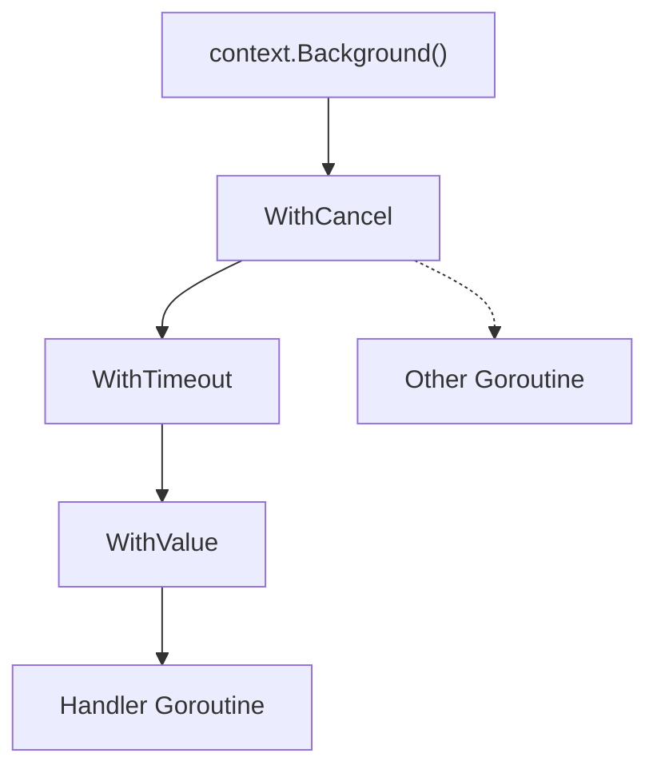
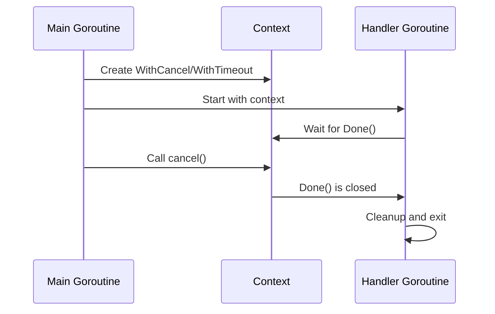
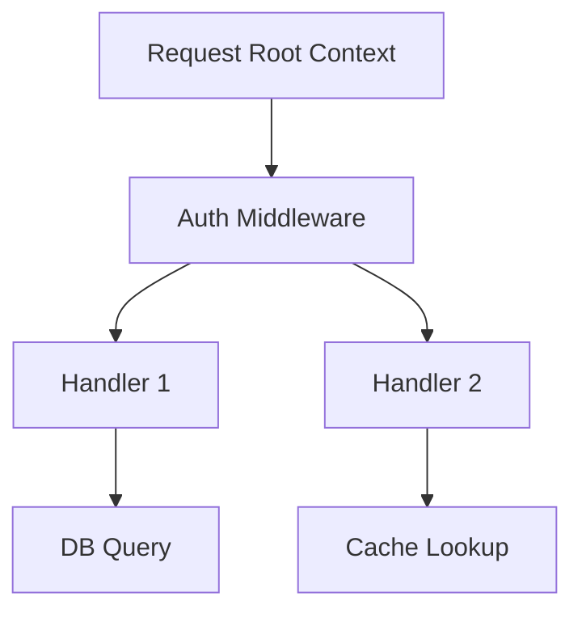

# Context and Cancellation: Concepts and Go Implementation ⏹️

> "Imagine you’re in a busy airport. You’re waiting for your flight, but you need to be ready to leave at a moment’s notice if your gate changes, your flight is canceled, or you get a call from home. In Go, `context.Context` is your boarding pass: it carries deadlines, cancellation signals, and extra info everywhere you go!"

---

## 🚦 Why Context Matters in Networking

- **Networking is unpredictable:** Clients disconnect, timeouts happen, and requests may need to be canceled.
- **Go’s solution:** The `context` package lets you control cancellation, timeouts, and pass request-scoped data across API boundaries and goroutines.
- **Analogy:** Context is like a walkie-talkie for your goroutines—when the boss says "stop!", everyone hears it and can clean up.

---

## 🧠 What is `context.Context`?

- **A signal carrier:** It lets you signal cancellation, set deadlines, and pass values down a call chain.
- **Propagation:** Contexts are passed explicitly as the first argument to functions that do work on behalf of a request.
- **Immutable:** When you add a deadline, value, or cancelation, you get a new derived context.

**Go proverb:** "Do not store Contexts inside a struct type; instead, pass a Context explicitly to each function that needs it."

---

## 🏗️ Context in Action: Basic Cancellation

Let’s see how to cancel a goroutine using context.

```go
package main
import (
    "context"
    "fmt"
    "time"
)

func main() {
    ctx, cancel := context.WithCancel(context.Background())
    go func() {
        for {
            select {
            case <-ctx.Done():
                fmt.Println("Goroutine canceled!")
                return
            default:
                fmt.Println("Working...")
                time.Sleep(500 * time.Millisecond)
            }
        }
    }()
    time.Sleep(2 * time.Second)
    cancel() // Signal cancellation
    time.Sleep(1 * time.Second)
}
```

[Exercise: Context Cancel Basic](../../exercises/part2/09-context-cancel-basic/main.go)

---

## ⏰ Context with Deadlines and Timeouts

- **Deadlines:** Stop work after a specific time.
- **Timeouts:** Like deadlines, but relative to now.

```go
ctx, cancel := context.WithTimeout(context.Background(), 2*time.Second)
defer cancel()

select {
case <-ctx.Done():
    fmt.Println("Timed out or canceled!")
}
```

[Exercise: Context Deadline](../../exercises/part2/09-context-deadline/main.go)

---

## 🧳 Passing Values with Context

- **Use sparingly:** Only for request-scoped data (e.g., auth tokens, trace IDs).
- **Not for everything:** Don’t use context for passing optional parameters or configs.

```go
ctx := context.WithValue(context.Background(), "userID", 42)
userID := ctx.Value("userID")
fmt.Println("UserID:", userID)
```

[Exercise: Context Values](../../exercises/part2/09-context-values/main.go)

---

## 🛠️ Go in Action: Context in a TCP Server

Let’s build a TCP server that can cancel client handlers using context.

```go
package main
import (
    "context"
    "fmt"
    "net"
    "time"
)

func handleConn(ctx context.Context, c net.Conn) {
    defer c.Close()
    buf := make([]byte, 1024)
    for {
        select {
        case <-ctx.Done():
            fmt.Fprintln(c, "Server: connection canceled!")
            return
        default:
            c.SetReadDeadline(time.Now().Add(1 * time.Second))
            n, err := c.Read(buf)
            if err != nil {
                return
            }
            c.Write(buf[:n])
        }
    }
}

func main() {
    ln, _ := net.Listen("tcp", ":9001")
    fmt.Println("Listening on :9001...")
    for {
        conn, _ := ln.Accept()
        ctx, cancel := context.WithTimeout(context.Background(), 10*time.Second)
        go func() {
            handleConn(ctx, conn)
            cancel()
        }()
    }
}
```

[Exercise: Context TCP Server](../../exercises/part2/09-context-tcp-server/main.go)

---

## 🧩 How Context Propagates: Visual Flow



**Explanation:**
- Each new context is derived from its parent, carrying cancellation and values down the chain.
- When a parent is canceled, all children are canceled too.

---

## 🖥️ Sequence: Context Cancellation in Practice



---

## 🧬 Deep Dive: How Go’s Context Works Internally

- **Context is an interface:**
  - `Deadline()`, `Done()`, `Err()`, `Value(key)`
- **Cancelation is a broadcast:**
  - When you call `cancel()`, all goroutines waiting on `Done()` are notified instantly (via a closed channel).
- **Deadlines/Timeouts:**
  - The runtime uses timers to close `Done()` when the time is up.
- **Values:**
  - Stored in a tree structure, accessible by key.
- **Propagation:**
  - Canceling a parent context cancels all children—great for request trees!

---

## 📝 Example: Context Tree in a Web Server



**Explanation:**
- Each request gets a root context.
- Middleware and handlers derive new contexts (add values, deadlines).
- Canceling the root cancels all work for the request.

---

## 🧠 Key Takeaways
- Use context to control cancellation, timeouts, and pass request-scoped data.
- Always pass context as the first argument (`ctx context.Context`).
- Cancel contexts to clean up goroutines and resources.
- Contexts propagate signals down the call chain—great for complex systems!
- Don’t use context for everything—only for data that must travel with a request.

---

## 🧪 Exercises
- [Context Cancel Basic](../../exercises/part2/09-context-cancel-basic/main.go)
- [Context Deadline](../../exercises/part2/09-context-deadline/main.go)
- [Context TCP Server](../../exercises/part2/09-context-tcp-server/main.go)
- [Context Values](../../exercises/part2/09-context-values/main.go)

---

[Previous: Concurrency in Networking](08-concurrency-in-networking.md) | [Next: HTTP: Protocol Theory and Go Implementation](10-http-protocol-theory-and-go-implementation.md)
