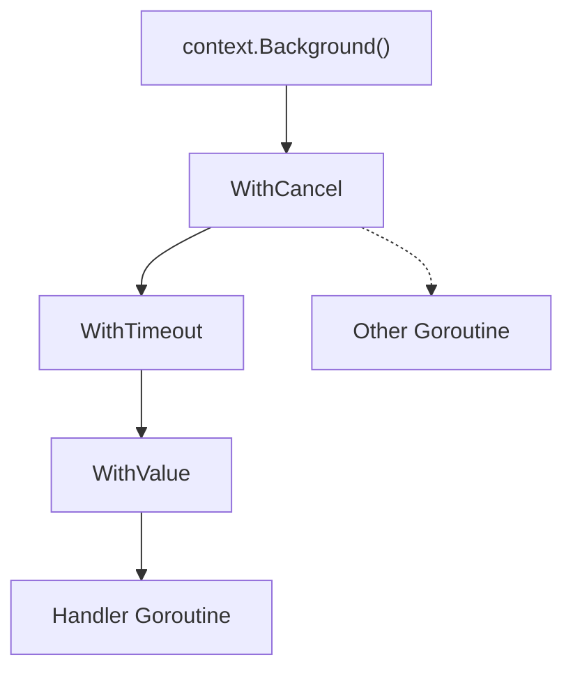
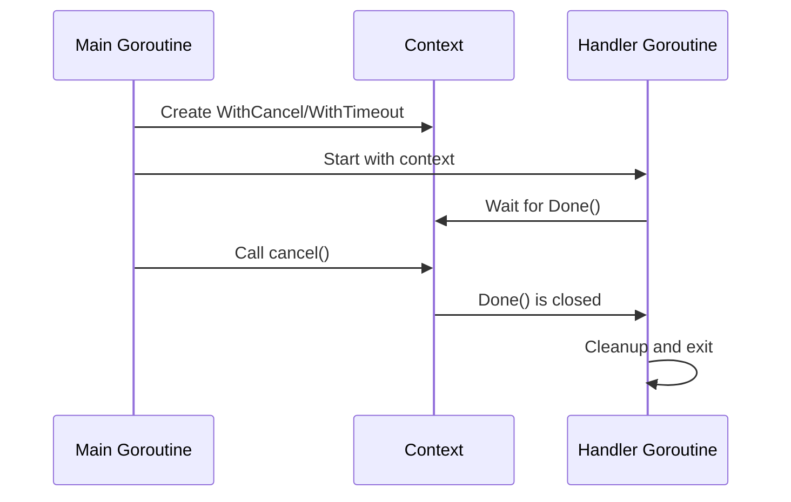
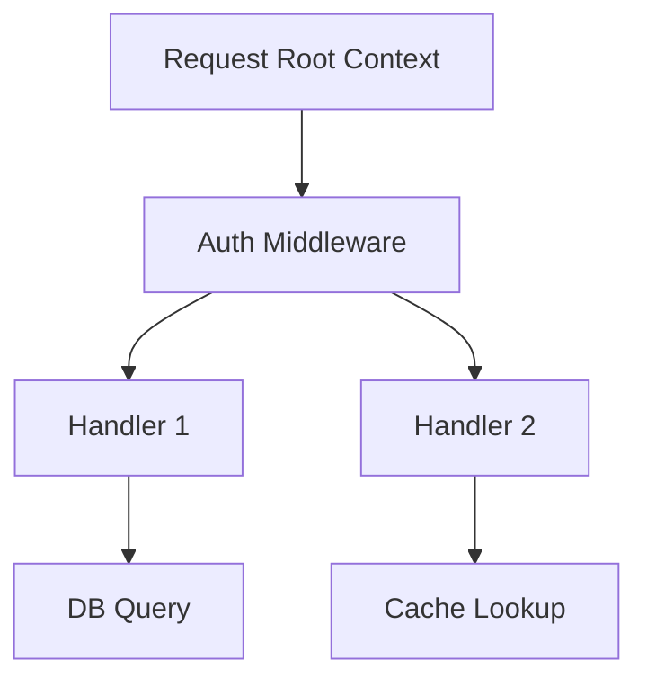

# Context and Cancellation: Concepts and Go Implementation

> "Imagine you’re in a busy airport. You’re waiting for your flight, but you need to be ready to leave at a moment’s notice if your gate changes, your flight is canceled, or you get a call from home. In Go, `context.Context` is your boarding pass: it carries deadlines, cancellation signals, and extra info everywhere you go!"

---

## Why Context Matters in Networking

- **Networking is unpredictable:** Clients disconnect, timeouts happen, and requests may need to be canceled.
- **Go’s solution:** The `context` package lets you control cancellation, timeouts, and pass request-scoped data across API boundaries and goroutines.
- **Analogy:** Context is like a walkie-talkie for your goroutines—when the boss says "stop!", everyone hears it and can clean up.

<Axiom>Context does not do work — it tells work when to stop.</Axiom>

---

## What is `context.Context`?

- **A signal carrier:** It lets you signal cancellation, set deadlines, and pass values down a call chain.
- **Propagation:** Contexts are passed explicitly as the first argument to functions that do work on behalf of a request.
- **Immutable:** When you add a deadline, value, or cancelation, you get a new derived context.

**Go proverb:** "Do not store Contexts inside a struct type; instead, pass a Context explicitly to each function that needs it."

**Why the first parameter, and why named `ctx`?** Any function that
touches the network or another goroutine can block, and the caller
needs a uniform way to say "stop waiting". Putting `ctx
context.Context` first makes that contract visible at a glance in
every signature, and `go vet`/linters expect it there. Name it `ctx`,
never `context` (that shadows the package import).

<Warning title="Storing context in a struct">It's tempting to add a `ctx context.Context` field to a struct so you don't have to thread it through every method. Don't — a stored context is a snapshot from when the struct was built, so it goes stale the moment a *different* request's context should apply, and it hides the cancellation contract from anyone reading a method signature. Pass it explicitly as the first parameter of every method that needs it.</Warning>

<Warning title="Reaching for context.Background() out of laziness">`context.Background()` belongs in exactly two places: the top of `main()`, and tests. If a function deep in a request handler calls it instead of using the `ctx` it was handed, that work silently opts out of the caller's timeout and cancellation — a database query started this way keeps running even after the client has long since disconnected. Always propagate the real context down the call chain.</Warning>

---

## Context in Action: Basic Cancellation

Let’s see how to cancel a goroutine using context.

```go
package main
import (
    "context"
    "fmt"
    "time"
)

func main() {
    ctx, cancel := context.WithCancel(context.Background())
    go func() {
        for {
            select {
            case <-ctx.Done():
                fmt.Println("Goroutine canceled!")
                return
            default:
                fmt.Println("Working...")
                time.Sleep(500 * time.Millisecond)
            }
        }
    }()
    time.Sleep(2 * time.Second)
    cancel() // Signal cancellation
    time.Sleep(1 * time.Second)
}
```

[Exercise: Context Cancel Basic](../../exercises/part2/09-context-cancel-basic/main.go)

`cancel()` is called explicitly at the bottom of `main` above just so
you can watch the goroutine react. In real code, schedule it with
`defer cancel()` right next to where you created the context, not
"eventually, somewhere later".

<Warning title="Forgetting to call cancel() leaks resources">`WithCancel`, `WithTimeout`, and `WithDeadline` all start bookkeeping in the background — a timer for the timeout variants, plus an entry in the parent's list of children. Never calling the returned `cancel` leaves that timer running and the parent holding a reference to the child until the deadline eventually fires (or forever, for `WithCancel`). In a busy server, thousands of forgotten `cancel` calls means thousands of live timers that never get cleaned up. The fix: `ctx, cancel := context.WithTimeout(...)` followed immediately by `defer cancel()` — calling `cancel()` twice is always a safe no-op.</Warning>

---

## Context with Deadlines and Timeouts

- **Deadlines:** Stop work after a specific time.
- **Timeouts:** Like deadlines, but relative to now.

```go
ctx, cancel := context.WithTimeout(context.Background(), 2*time.Second)
defer cancel()

select {
case <-ctx.Done():
    fmt.Println("Timed out or canceled!")
}
```

**Why does this matter more for network code than for CPU-bound
code?** A CPU-bound loop can check `ctx.Done()` every iteration and
exit almost immediately. A network call instead hands control to the
OS: once you call `conn.Read` or `http.Client.Do`, your goroutine is
blocked until the kernel returns *something*. A context deadline is
what lets context-aware APIs like `net.Dialer.DialContext` or
`http.NewRequestWithContext` interrupt that blocked call, instead of
leaving you stuck until the OS-level socket timeout (minutes away, or
nonexistent).

Let's put that to work against a real network call, and use
`ctx.Err()` to tell a timeout apart from a manual cancellation:

```go
package main

import (
	"context"
	"errors"
	"fmt"
	"net"
	"time"
)

func dialWithContext(ctx context.Context, addr string) error {
	var d net.Dialer
	conn, err := d.DialContext(ctx, "tcp", addr)
	if err != nil {
		// ctx.Err() tells us *why* the dial gave up.
		switch {
		case errors.Is(ctx.Err(), context.DeadlineExceeded):
			return fmt.Errorf("dial %s timed out: %w", addr, err)
		case errors.Is(ctx.Err(), context.Canceled):
			return fmt.Errorf("dial %s canceled: %w", addr, err)
		default:
			return fmt.Errorf("dial %s failed: %w", addr, err)
		}
	}
	defer conn.Close()
	return nil
}

func main() {
	ctx, cancel := context.WithTimeout(context.Background(), 2*time.Second)
	defer cancel()

	if err := dialWithContext(ctx, "localhost:9999"); err != nil {
		fmt.Println(err)
	}
}
```

- **¿Qué hace cada parte?**
  - `net.Dialer.DialContext`: abandons the connection attempt the
    moment `ctx` is done, instead of waiting on the OS's own
    (often much longer) connect timeout.
  - `ctx.Err()`: meaningful only after `Done()` fires. It is exactly
    one of `context.DeadlineExceeded` or `context.Canceled` — never a
    generic error — so branching on it with `errors.Is` lets the
    caller decide whether a retry makes sense.

[Exercise: Context Deadline](../../exercises/part2/09-context-deadline/main.go)

---

## Passing Values with Context

- **Use sparingly:** Only for request-scoped data (e.g., auth tokens, trace IDs).
- **Not for everything:** Don’t use context for passing optional parameters or configs.

```go
ctx := context.WithValue(context.Background(), "userID", 42)
userID := ctx.Value("userID")
fmt.Println("UserID:", userID)
```

<Warning title="Plain string keys collide">The snippet above uses the bare string `"userID"` as a key. It works in isolation, but `context.Value` is looked up across the *entire* dependency tree — if any other package also happens to use the string `"userID"`, the two collide silently and one overwrites the other. `go vet` flags this pattern (SA1029) because it has caused real production bugs. The fix is an unexported key type, which no other package can ever construct a colliding value of: ```go package main import ( "context" "fmt" ) type ctxKey int const userIDKey ctxKey = iota func main() { ctx := context.WithValue(context.Background(), userIDKey, 42) userID := ctx.Value(userIDKey) fmt.Println("UserID:", userID) } ``` Because `ctxKey` is unexported, no other package can construct a value of that type — so no other package's key can ever collide with `userIDKey`, even one using the same underlying string or int.</Warning>

[Exercise: Context Values](../../exercises/part2/09-context-values/main.go)

---

## Go in Action: Context in a TCP Server

Let’s build a TCP server that can cancel client handlers using context.

```go
package main
import (
    "context"
    "errors"
    "fmt"
    "net"
    "time"
)

func handleConn(ctx context.Context, c net.Conn) {
    defer c.Close()
    buf := make([]byte, 1024)
    for {
        select {
        case <-ctx.Done():
            // ctx.Err() tells us exactly why we stopped: a 10s
            // timeout elapsed, or the caller canceled explicitly.
            fmt.Fprintf(c, "Server: connection ended: %v\n", ctx.Err())
            return
        default:
            c.SetReadDeadline(time.Now().Add(1 * time.Second))
            n, err := c.Read(buf)
            if err != nil {
                var netErr net.Error
                if errors.As(err, &netErr) && netErr.Timeout() {
                    // Just the per-Read deadline; loop back around
                    // and let the select re-check ctx.Done().
                    continue
                }
                return
            }
            c.Write(buf[:n])
        }
    }
}

func main() {
    ln, err := net.Listen("tcp", ":9001")
    if err != nil {
        fmt.Println("Could not start listener:", err)
        return
    }
    fmt.Println("Listening on :9001...")
    for {
        conn, err := ln.Accept()
        if err != nil {
            fmt.Println("Accept error:", err)
            continue
        }
        ctx, cancel := context.WithTimeout(context.Background(), 10*time.Second)
        go func() {
            defer cancel()
            handleConn(ctx, conn)
        }()
    }
}
```

- **What changed from the first version, and why?**
  - `ln.Accept()`'s error is now checked instead of discarded with
    `_` — a transient accept error (too many open files) should log
    and keep serving, not crash silently on the next line.
  - `defer cancel()` replaces a bare `cancel()` call after `handleConn`
    returns, so it still runs if `handleConn` ever panics.
  - The per-`Read` deadline's timeout is told apart from the outer
    context's deadline: a `net.Error` timeout on `Read` means "no data
    in the last second, keep looping", while `ctx.Done()` means "this
    connection's whole time budget is up — stop for good".

[Exercise: Context TCP Server](../../exercises/part2/09-context-tcp-server/main.go)

<Warning title="A goroutine that ignores ctx.Done() leaks forever">The `select`/`default` pattern above is what makes this handler cancelable. If `handleConn` instead did a plain blocking `c.Read(buf)` with no deadline and no `select` on `ctx.Done()`, canceling the context would do nothing — the goroutine sits blocked in the kernel read syscall until the *peer* closes the connection, which may be never. Every cancelable goroutine must either poll `ctx.Done()` in a loop or be handed something context-aware, like `DialContext` or a request built with `http.NewRequestWithContext`.</Warning>

---

## How Context Propagates: Visual Flow



**Explanation:**
- Each new context is derived from its parent, carrying cancellation and values down the chain.
- When a parent is canceled, all children are canceled too.

<DeepDive title="Why not just pass a channel or a bool flag?">Before `context` existed, Go code cancelled work with a hand-rolled `done chan struct{}` closed by the caller, or a `*bool` checked in a loop. Neither composes: no standard way to attach a deadline, carry a request ID, or let a child's cancellation automatically follow its parent's. `context` standardizes all three behind one interface every stdlib networking function already understands — a timeout set at the top of a handler automatically governs the DNS lookup, TCP dial, and HTTP round trip several layers below, with zero extra plumbing.</DeepDive>

---

## Sequence: Context Cancellation in Practice



This diagram only plays out if `Handler` is actually waiting in a
`select` on `Done()` — the same requirement flagged in the Warning
above. A handler stuck in a blocking call with no `ctx.Done()` case
never receives step 5 at all; `cancel()` still runs, `Done()` still
closes, but the handler simply never looks.

---

## Deep Dive: How Go’s Context Works Internally

- **Context is an interface:**
  - `Deadline()`, `Done()`, `Err()`, `Value(key)`
- **Cancelation is a broadcast:**
  - When you call `cancel()`, all goroutines waiting on `Done()` are notified instantly (via a closed channel).
- **Deadlines/Timeouts:**
  - The runtime uses timers to close `Done()` when the time is up.
- **Values:**
  - Stored in a tree structure, accessible by key.
- **Propagation:**
  - Canceling a parent context cancels all children—great for request trees!

<DeepDive title="Inside the standard library implementation">The concrete types backing `context.Context` are unexported, but their shape explains the behavior above. `Background()` returns an `emptyCtx`, never canceled, holding no values. `WithCancel` wraps it in a `cancelCtx` (a mutex, a lazily-created `done` channel, and a list of children to also cancel). `WithTimeout`/`WithDeadline` add a `*time.Timer` that calls `cancel(DeadlineExceeded)` when it fires — the resource a forgotten `cancel()` leaves running. `WithValue` wraps its parent in a `valueCtx` holding one key/value pair, so a chain of `WithValue` calls is a linked list walked on every lookup, not a map.</DeepDive>

---

## Example: Context Tree in a Web Server



**Explanation:**
- Each request gets a root context.
- Middleware and handlers derive new contexts (add values, deadlines).
- Canceling the root cancels all work for the request.

---

## Key Takeaways
- Use context to control cancellation, timeouts, and pass request-scoped data.
- Always pass context as the first argument (`ctx context.Context`).
- Cancel contexts to clean up goroutines and resources.
- Contexts propagate signals down the call chain—great for complex systems!
- Don’t use context for everything—only for data that must travel with a request.
- Pair every `With*` call with a `defer cancel()` on the very next line.
- Check `ctx.Err()` (`context.Canceled` vs `context.DeadlineExceeded`)
  to tell *why* work stopped, not just *that* it stopped.
- Use unexported key types with `context.Value`, never bare strings.
- Any goroutine that ignores `ctx.Done()` is a goroutine that leaks.

<Axiom>A context without a cancel function is a timer with no off switch.</Axiom>

---

## Try It Yourself: A Cancelable Fan-Out Client

Combine cancellation, timeouts, and values into one small program:

1. Write `fetchAll(ctx context.Context, addrs []string) []error` that
   dials every address in `addrs` concurrently with
   `net.Dialer.DialContext`, using a single shared `ctx`.
2. Build that shared `ctx` with `context.WithTimeout(parent, 3*time.
   Second)` in `main`, and `defer cancel()` immediately. Attach a
   request ID with `context.WithValue` using an unexported key type
   (see the Warning above), and log it from each dial goroutine.
3. Run it once letting it time out naturally, and once canceling the
   parent early (`cancel()`), confirming each goroutine reports the
   *correct* `ctx.Err()` for its case, and verify with `go run -race`
   that no goroutine writes the shared result slice unsynchronized.

If every goroutine exits promptly the instant you cancel — instead of
lingering until each individual dial's own OS-level timeout — you've
built a correctly cancelable fan-out.

---

## Exercises
- [Context Cancel Basic](../../exercises/part2/09-context-cancel-basic/main.go)
- [Context Deadline](../../exercises/part2/09-context-deadline/main.go)
- [Context TCP Server](../../exercises/part2/09-context-tcp-server/main.go)
- [Context Values](../../exercises/part2/09-context-values/main.go)
