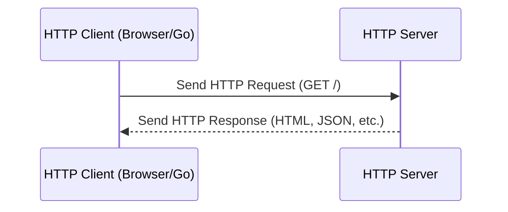

# HTTP: Protocol Theory and Go Implementation 🌐

> "Imagine a postal service: you write a letter (request), send it to an address (server), and wait for a reply (response). HTTP is the protocol that defines how these letters are formatted, sent, and received over the internet."

---

## 🚦 What is HTTP?
- **HTTP (Hypertext Transfer Protocol)** is the foundation of data communication on the web.
- **Request/Response Model:** Clients (like browsers or Go programs) send requests; servers respond with data.
- **Stateless:** Each request is independent—servers don’t remember previous requests by default.
- **Analogy:** Like sending a letter and getting a reply—each letter stands alone.

---

## 🧩 HTTP Request/Response Lifecycle



---

## 🛠️ Go in Action: Basic HTTP Server

Let’s build a simple HTTP server in Go that responds with a greeting.

```go
package main
import (
    "fmt"
    "net/http"
)

func handler(w http.ResponseWriter, r *http.Request) {
    fmt.Fprintln(w, "Hello, world! Basic HTTP server in Go.")
}

func main() {
    http.HandleFunc("/", handler)
    fmt.Println("Server listening at http://localhost:8080 ...")
    http.ListenAndServe(":8080", nil)
}
```

[Exercise: Basic HTTP Server](../../exercises/part2/10-http-server-basic/main.go)

---

## 🛠️ Go in Action: Basic HTTP Client

Let’s write a Go program that fetches a web page.

```go
package main
import (
    "fmt"
    "io"
    "net/http"
)

func main() {
    resp, err := http.Get("http://example.com")
    if err != nil {
        panic(err)
    }
    defer resp.Body.Close()
    body, _ := io.ReadAll(resp.Body)
    fmt.Println("Server response:")
    fmt.Println(string(body))
}
```

[Exercise: Basic HTTP Client](../../exercises/part2/10-http-client-basic/main.go)

---

## 🛣️ Go in Action: Routing and Concurrent Servers

- **Routing:** Direct different URLs to different handlers.
- **Concurrency:** Go’s HTTP server handles each request in its own goroutine.

**Example: Custom Routes**

```go
package main
import (
    "fmt"
    "net/http"
)

func helloHandler(w http.ResponseWriter, r *http.Request) {
    fmt.Fprintln(w, "Hello from /hello!")
}

func byeHandler(w http.ResponseWriter, r *http.Request) {
    fmt.Fprintln(w, "Goodbye from /bye!")
}

func main() {
    http.HandleFunc("/hello", helloHandler)
    http.HandleFunc("/bye", byeHandler)
    fmt.Println("Server listening at http://localhost:8081 ...")
    http.ListenAndServe(":8081", nil)
}
```

[Exercise: HTTP Server Routing](../../exercises/part2/10-http-server-routing/main.go)

**Example: Concurrent HTTP Server**

```go
package main
import (
    "fmt"
    "net/http"
    "sync/atomic"
)

var counter int64

func handler(w http.ResponseWriter, r *http.Request) {
    n := atomic.AddInt64(&counter, 1)
    fmt.Fprintf(w, "Request #%d handled concurrently\n", n)
}

func main() {
    http.HandleFunc("/", handler)
    fmt.Println("Concurrent server at http://localhost:8082 ...")
    http.ListenAndServe(":8082", nil)
}
```

[Exercise: Concurrent HTTP Server](../../exercises/part2/10-http-server-concurrent/main.go)

---

## ⏹️ Go in Action: HTTP with Context and Cancellation

- **Context:** Allows canceling long-running requests if the client disconnects.

```go
package main
import (
    "fmt"
    "net/http"
    "time"
)

func handler(w http.ResponseWriter, r *http.Request) {
    ctx := r.Context()
    fmt.Println("Request received, processing...")

    select {
    case <-time.After(5 * time.Second):
        fmt.Fprintln(w, "Processing complete!")
    case <-ctx.Done():
        fmt.Fprintln(w, "Request canceled by client.")
    }
}

func main() {
    http.HandleFunc("/", handler)
    fmt.Println("Server with context at http://localhost:8083 ...")
    http.ListenAndServe(":8083", nil)
}
```

[Exercise: HTTP Server with Context](../../exercises/part2/10-http-server-context/main.go)

---

## 🧠 Key Takeaways
- HTTP is the backbone of web communication: request/response, stateless, text-based.
- Go’s `net/http` package makes building servers and clients easy and concurrent.
- Use handlers for routing, and context for cancellation.
- Each request is handled in its own goroutine—scalable by default!

---

## 🧪 Exercises
- [Basic HTTP Server](../../exercises/part2/10-http-server-basic/main.go)
- [Basic HTTP Client](../../exercises/part2/10-http-client-basic/main.go)
- [HTTP Server Routing](../../exercises/part2/10-http-server-routing/main.go)
- [Concurrent HTTP Server](../../exercises/part2/10-http-server-concurrent/main.go)
- [HTTP Server with Context](../../exercises/part2/10-http-server-context/main.go)

---

[Previous: Context and Cancellation](09-context-and-cancellation.md) | [Next: Handling JSON and XML over HTTP](11-handling-json-and-xml-over-http.md)
