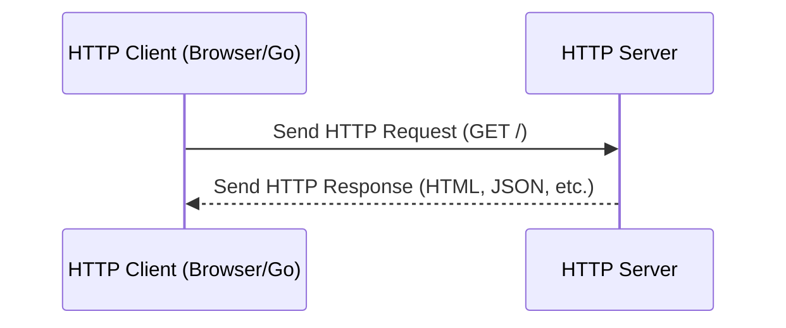

# HTTP: Protocol Theory and Go Implementation

> "Imagine a postal service: you write a letter (request), send it to an address (server), and wait for a reply (response). HTTP is the protocol that defines how these letters are formatted, sent, and received over the internet."

---

## What is HTTP?
- **HTTP (Hypertext Transfer Protocol)** is the foundation of data communication on the web.
- **Request/Response Model:** Clients (like browsers or Go programs) send requests; servers respond with data.
- **Stateless:** Each request is independent—servers don’t remember previous requests by default.
- **Analogy:** Like sending a letter and getting a reply—each letter stands alone.

<Axiom>HTTP is just text over a connection: everything net/http does is convenience on top of that.</Axiom>

---

## Anatomy of a Request and a Response

A raw HTTP request is plain text with a strict shape: a request line,
a set of headers, a blank line, and an optional body. A response looks
almost the same, but starts with a status line instead.

**Methods** describe the intent of a request:

| Method | Meaning | Safe? | Idempotent? |
|--------|---------|-------|-------------|
| GET | Retrieve a resource | Yes | Yes |
| HEAD | Like GET, headers only, no body | Yes | Yes |
| POST | Create a resource / submit data | No | No |
| PUT | Replace a resource entirely | No | Yes |
| PATCH | Partially update a resource | No | No |
| DELETE | Remove a resource | No | Yes |
| OPTIONS | Ask what methods/headers are allowed | Yes | Yes |

- **Safe** means the method shouldn't change server state (GET should
  never delete data, even if a client calls it twice).
- **Idempotent** means calling it once or ten times leaves the server in
  the same state — useful for safe retries after a timeout.

**Status codes** are grouped by their first digit:

| Range | Class | Example |
|-------|-------|---------|
| 1xx | Informational | 100 Continue |
| 2xx | Success | 200 OK, 201 Created, 204 No Content |
| 3xx | Redirection | 301 Moved Permanently, 304 Not Modified |
| 4xx | Client error | 400 Bad Request, 404 Not Found, 429 Too Many Requests |
| 5xx | Server error | 500 Internal Server Error, 503 Unavailable |

**Headers** carry metadata about the message: `Content-Type` and
`Content-Length` describe the body, `Host` identifies the target
virtual server, `Authorization` carries credentials, and countless
custom `X-`-prefixed headers carry application-specific data.

<DeepDive title="HTTP/1.1, HTTP/2, and HTTP/3 in Go">HTTP/1.0 opened a new TCP connection per request — slow and wasteful. HTTP/1.1 added persistent ("keep-alive") connections and pipelining, so one TCP connection can serve many requests in sequence. HTTP/2 goes further: it multiplexes many requests over a *single* connection using a binary framing layer, so a slow response no longer head-of-line blocks the others, and it compresses headers with HPACK. Go's `net/http` negotiates HTTP/2 automatically over TLS (via ALPN) with no code changes on your part — `http.ListenAndServeTLS` gets it for free. HTTP/3 replaces TCP with QUIC over UDP to avoid TCP-level head-of-line blocking entirely; the standard library doesn't speak it yet, so you'd reach for a third-party module like `quic-go` if you need it.</DeepDive>

---

## HTTP Request/Response Lifecycle



---

## Go in Action: Basic HTTP Server

Let’s build a simple HTTP server in Go that responds with a greeting.

```go
package main
import (
    "fmt"
    "net/http"
)

func handler(w http.ResponseWriter, r *http.Request) {
    fmt.Fprintln(w, "Hello, world! Basic HTTP server in Go.")
}

func main() {
    http.HandleFunc("/", handler)
    fmt.Println("Server listening at http://localhost:8080 ...")
    http.ListenAndServe(":8080", nil)
}
```

[Exercise: Basic HTTP Server](../../exercises/part2/10-http-server-basic/main.go)

<Warning title="The Zero-Value http.Server Never Times Out">`http.ListenAndServe(":8080", nil)` builds an `http.Server` with every timeout field left at its zero value, which means "wait forever." A client that opens a connection and trickles in one byte every few seconds (a **Slowloris** attack, or just a flaky mobile client) can tie up a goroutine and a socket indefinitely. Always construct an `http.Server` explicitly and set `ReadTimeout`, `WriteTimeout`, and `IdleTimeout` in production code.</Warning>

**Extending the example with explicit timeouts:**

```go
package main
import (
    "fmt"
    "net/http"
    "time"
)

func handler(w http.ResponseWriter, r *http.Request) {
    fmt.Fprintln(w, "Hello, world! Basic HTTP server in Go.")
}

func main() {
    mux := http.NewServeMux()
    mux.HandleFunc("/", handler)

    server := &http.Server{
        Addr:              ":8080",
        Handler:           mux,
        ReadHeaderTimeout: 2 * time.Second,
        ReadTimeout:       5 * time.Second,
        WriteTimeout:      10 * time.Second,
        IdleTimeout:       120 * time.Second,
    }

    fmt.Println("Server listening at http://localhost:8080 ...")
    if err := server.ListenAndServe(); err != nil {
        fmt.Println("Server stopped:", err)
    }
}
```

<DeepDive title="What Each Server Timeout Actually Bounds">`ReadHeaderTimeout` bounds only the time to read the request line and headers — cheap protection against a client that opens a connection and sends headers one byte at a time. `ReadTimeout` bounds reading the entire request, headers plus body; set it generously if you accept file uploads. `WriteTimeout` bounds the time from when the request is fully read to when the response is fully written — including slow handler logic. `IdleTimeout` bounds how long a keep-alive connection can sit between requests before the server closes it, freeing file descriptors that an idle client would otherwise hold forever.</DeepDive>

---

## Go in Action: Basic HTTP Client

Let’s write a Go program that fetches a web page.

```go
package main
import (
    "fmt"
    "io"
    "net/http"
)

func main() {
    resp, err := http.Get("http://example.com")
    if err != nil {
        panic(err)
    }
    defer resp.Body.Close()
    body, _ := io.ReadAll(resp.Body)
    fmt.Println("Server response:")
    fmt.Println(string(body))
}
```

[Exercise: Basic HTTP Client](../../exercises/part2/10-http-client-basic/main.go)

<Warning title="defer resp.Body.Close() Is Not Optional">Every successful `http.Get`, `http.Post`, or `client.Do` returns a response whose `Body` must be closed, even if you don't read it. Skip `Close()` and the underlying TCP connection can't be returned to the client's connection pool — under load this leaks sockets and eventually exhausts file descriptors. Always pair the call with `defer resp.Body.Close()` right after checking the error.</Warning>

<Warning title="Don't Build a New http.Client Per Request">`http.Get` uses `http.DefaultClient`, which is fine for one-off scripts, but the zero-value client also has **no timeout** — a request to a server that never responds hangs forever. The fix isn't to allocate a fresh `&http.Client{}` on every call either: each `http.Client` owns its own connection pool (`Transport`), so creating one per request throws away keep-alive reuse and re-does a TCP/TLS handshake every time. Instead, create **one** `http.Client` with an explicit `Timeout` and reuse it across your program.</Warning>

**Extending the example with a reusable, timeout-bound client:**

```go
package main
import (
    "fmt"
    "io"
    "net/http"
    "time"
)

// Package-level client: one connection pool, reused by every call.
var client = &http.Client{
    Timeout: 10 * time.Second,
}

func main() {
    resp, err := client.Get("http://example.com")
    if err != nil {
        panic(err)
    }
    defer resp.Body.Close()

    body, _ := io.ReadAll(resp.Body)
    fmt.Println("Status:", resp.Status)
    fmt.Println("Server response:")
    fmt.Println(string(body))
}
```

<DeepDive title="Why Reusing a Client Matters">An `http.Client` caches idle TCP connections per host inside its `Transport` so a second request to the same server can skip the handshake entirely. Throwing away the client after every call throws away that cache, forcing a fresh DNS lookup, TCP handshake, and (for HTTPS) TLS handshake on every single request — measurably slower under any real load. `client.Timeout` also bounds the *entire* round trip (connect, headers, body), unlike a context deadline on just one part of the request, making it the simplest blanket protection against a hung server.</DeepDive>

---

## Go in Action: Routing and Concurrent Servers

- **Routing:** Direct different URLs to different handlers.
- **Concurrency:** Go’s HTTP server handles each request in its own goroutine.

**Example: Custom Routes**

```go
package main
import (
    "fmt"
    "net/http"
)

func helloHandler(w http.ResponseWriter, r *http.Request) {
    fmt.Fprintln(w, "Hello from /hello!")
}

func byeHandler(w http.ResponseWriter, r *http.Request) {
    fmt.Fprintln(w, "Goodbye from /bye!")
}

func main() {
    http.HandleFunc("/hello", helloHandler)
    http.HandleFunc("/bye", byeHandler)
    fmt.Println("Server listening at http://localhost:8081 ...")
    http.ListenAndServe(":8081", nil)
}
```

[Exercise: HTTP Server Routing](../../exercises/part2/10-http-server-routing/main.go)

<DeepDive title="HandlerFunc, Handler, and ServeMux">Under the hood, `http.HandleFunc` wraps your plain function in the `http.HandlerFunc` type, which is just a function type that implements the single-method `http.Handler` interface (`ServeHTTP(w, r)`). That's why anything with a `ServeHTTP` method — including middleware you write yourself — can be dropped in wherever a `Handler` is expected. `http.DefaultServeMux` (used implicitly when you pass `nil` as the handler) matches incoming paths by longest-prefix routing: a registration for `/hello/` matches `/hello/world`, while `/hello` (no trailing slash) matches only that exact path. For anything beyond simple prefix routing — path parameters, method-based dispatch — most real projects reach for a third-party router, but the interface-based design means they still just plug into `http.Handler`.</DeepDive>

**Example: Concurrent HTTP Server**

```go
package main
import (
    "fmt"
    "net/http"
    "sync/atomic"
)

var counter int64

func handler(w http.ResponseWriter, r *http.Request) {
    n := atomic.AddInt64(&counter, 1)
    fmt.Fprintf(w, "Request #%d handled concurrently\n", n)
}

func main() {
    http.HandleFunc("/", handler)
    fmt.Println("Concurrent server at http://localhost:8082 ...")
    http.ListenAndServe(":8082", nil)
}
```

[Exercise: Concurrent HTTP Server](../../exercises/part2/10-http-server-concurrent/main.go)

---

## Go in Action: HTTP with Context and Cancellation

- **Context:** Allows canceling long-running requests if the client disconnects.

```go
package main
import (
    "fmt"
    "net/http"
    "time"
)

func handler(w http.ResponseWriter, r *http.Request) {
    ctx := r.Context()
    fmt.Println("Request received, processing...")

    select {
    case <-time.After(5 * time.Second):
        fmt.Fprintln(w, "Processing complete!")
    case <-ctx.Done():
        fmt.Fprintln(w, "Request canceled by client.")
    }
}

func main() {
    http.HandleFunc("/", handler)
    fmt.Println("Server with context at http://localhost:8083 ...")
    http.ListenAndServe(":8083", nil)
}
```

[Exercise: HTTP Server with Context](../../exercises/part2/10-http-server-context/main.go)

---

## Go in Action: Graceful Shutdown

A production server shouldn't just die when it receives `Ctrl+C` or a
`SIGTERM` from an orchestrator — in-flight requests deserve a chance to
finish. `Server.Shutdown(ctx)` stops accepting new connections
immediately, then waits for active requests to complete (or for the
context to expire) before returning.

```go
package main
import (
    "context"
    "fmt"
    "net/http"
    "os"
    "os/signal"
    "time"
)

func handler(w http.ResponseWriter, r *http.Request) {
    fmt.Fprintln(w, "Hello! This server shuts down gracefully.")
}

func main() {
    mux := http.NewServeMux()
    mux.HandleFunc("/", handler)

    server := &http.Server{
        Addr:         ":8084",
        Handler:      mux,
        ReadTimeout:  5 * time.Second,
        WriteTimeout: 10 * time.Second,
    }

    // Cancel ctx when the process receives an interrupt signal.
    ctx, stop := signal.NotifyContext(context.Background(), os.Interrupt)
    defer stop()

    go func() {
        fmt.Println("Server listening at http://localhost:8084 ...")
        err := server.ListenAndServe()
        if err != nil && err != http.ErrServerClosed {
            fmt.Println("Server error:", err)
        }
    }()

    <-ctx.Done() // Blocks here until Ctrl+C (or SIGTERM) arrives
    fmt.Println("Shutdown signal received, draining connections...")

    shutdownCtx, cancel := context.WithTimeout(
        context.Background(), 5*time.Second)
    defer cancel()

    if err := server.Shutdown(shutdownCtx); err != nil {
        fmt.Println("Forced shutdown:", err)
    } else {
        fmt.Println("Server stopped cleanly.")
    }
}
```

<DeepDive title="What Shutdown Does and Doesn't Wait For">`Shutdown` closes all open listeners so no new connection can start, then waits for handlers that are already running to return, checking back roughly every 500 milliseconds until the context deadline. If the deadline passes first, `Shutdown` returns the context's error and any still-running handlers are left to finish or be killed when the process exits — the deadline is your safety valve against one handler that hangs forever. Note that `Shutdown` does **not** track hijacked connections such as WebSockets; if your server upgrades connections, you're responsible for closing those yourself, typically by fanning out your own cancellation signal to each connection's goroutine.</DeepDive>

<Axiom>A server without a shutdown path doesn't stop — it just gets killed mid-sentence.</Axiom>

---

## Try It Yourself: Timeouts and Graceful Shutdown

1. Run the graceful shutdown server above and, in another terminal,
   confirm it responds: `curl http://localhost:8084/`.
2. Press `Ctrl+C` in the server's terminal. You should see "Shutdown
   signal received..." printed *before* the process exits, not an
   abrupt kill.
3. Temporarily change the handler to `time.Sleep(2 * time.Second)`
   before writing its response, and lower `WriteTimeout` to
   `500 * time.Millisecond`. Hit the endpoint with `curl -v` again —
   instead of hanging for 2 seconds, the connection is now cut short by
   the server, and curl reports an error.
4. Start two slow requests in separate terminals, then `Ctrl+C` the
   server. Confirm both requests still complete successfully before the
   process exits — that's `Shutdown` draining in-flight work.

---

## Frequently Asked Questions

**My HTTP server hangs forever on a slow or misbehaving client — why doesn't Go stop it automatically?**
Because `http.ListenAndServe(":8080", nil)` builds an `http.Server` with every timeout field left at its zero value, which literally means "wait forever" — nothing protects you from a Slowloris-style client trickling in one byte every few seconds. The fix is to construct the `http.Server` explicitly, as shown earlier in this chapter, and set `ReadHeaderTimeout`, `ReadTimeout`, `WriteTimeout`, and `IdleTimeout` rather than relying on the convenience function's defaults.

**Do I need to close `resp.Body` even if I never read from it?**
Yes, every time, with no exceptions — skipping `resp.Body.Close()` means the underlying TCP connection can never be returned to the client's connection pool, and under sustained load that quietly leaks sockets until you run out of file descriptors. Pair every successful `http.Get`/`client.Do` call with `defer resp.Body.Close()` immediately after checking the error, exactly like the basic HTTP client example does.

**Is it better to create a fresh `http.Client` for each request so nothing gets shared between calls?**
No, and this is a common overcorrection: each `http.Client` owns its own connection pool through its `Transport`, so a new client per request throws away keep-alive reuse and forces a fresh DNS lookup plus TCP (and TLS, for HTTPS) handshake every single time. Create one `http.Client` with an explicit `Timeout` at package level and reuse it across your whole program, the way the reusable-client example does.

**What's the actual difference between a context deadline on a request and `Server.Shutdown`'s context?**
A request-scoped context (like `r.Context()` in the cancellation example) governs one in-flight request and fires when that specific client disconnects or its deadline passes. `Server.Shutdown(ctx)`'s context is different: it bounds how long the *whole server* will wait for every currently running handler to finish before giving up and returning, acting as a safety valve on the shutdown process itself rather than on any single request.

**If I upgrade a connection to a WebSocket, will `Server.Shutdown` wait for it to close gracefully too?**
No — `Shutdown` only tracks ordinary HTTP handlers; hijacked connections such as WebSockets fall outside its bookkeeping entirely. If your server upgrades connections, you're responsible for closing those yourself, typically by fanning your own cancellation signal out to each connection's goroutine alongside the server's shutdown signal.

---

## Key Takeaways
- HTTP is the backbone of web communication: request/response, stateless, text-based.
- Go’s `net/http` package makes building servers and clients easy and concurrent.
- Use handlers for routing, and context for cancellation.
- Each request is handled in its own goroutine—scalable by default!
- Always set explicit `Server` timeouts (`ReadTimeout`, `WriteTimeout`,
  `IdleTimeout`) — the zero-value server never times out.
- Reuse a single `http.Client` with a `Timeout` set; never build one per
  request, and always `defer resp.Body.Close()`.
- Prefer `Server.Shutdown(ctx)` over letting the process die abruptly,
  so in-flight requests get a chance to finish.

---

## Exercises
- [Basic HTTP Server](../../exercises/part2/10-http-server-basic/main.go)
- [Basic HTTP Client](../../exercises/part2/10-http-client-basic/main.go)
- [HTTP Server Routing](../../exercises/part2/10-http-server-routing/main.go)
- [Concurrent HTTP Server](../../exercises/part2/10-http-server-concurrent/main.go)
- [HTTP Server with Context](../../exercises/part2/10-http-server-context/main.go)
