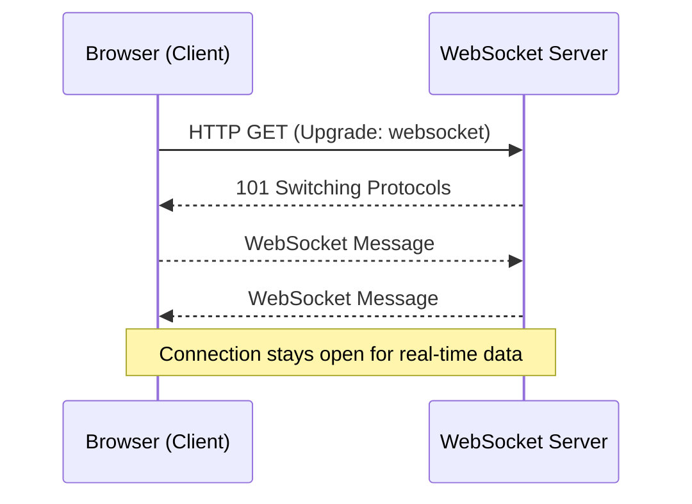
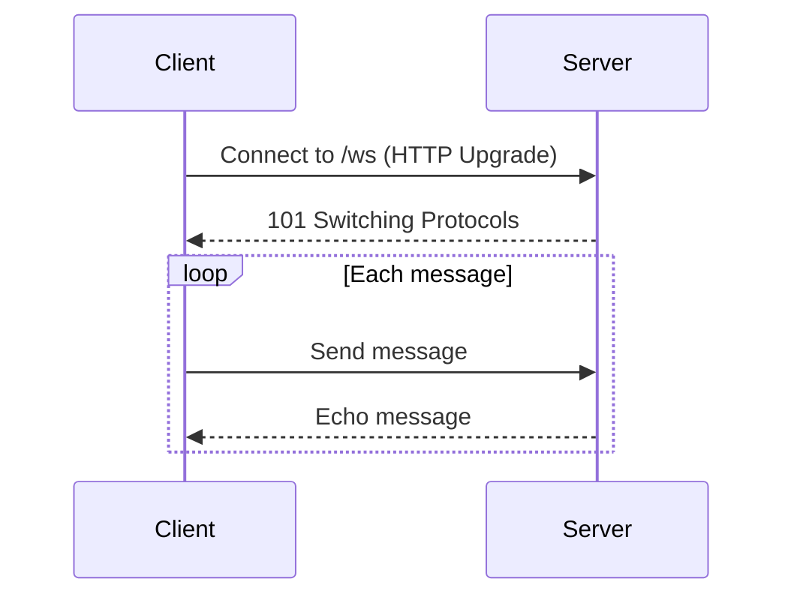
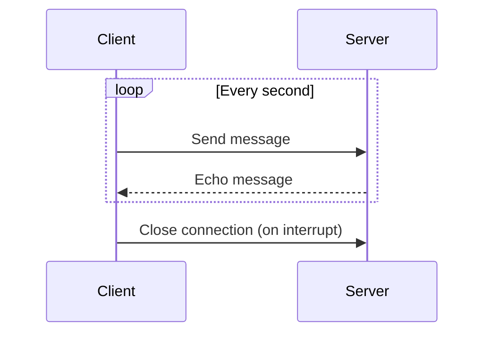
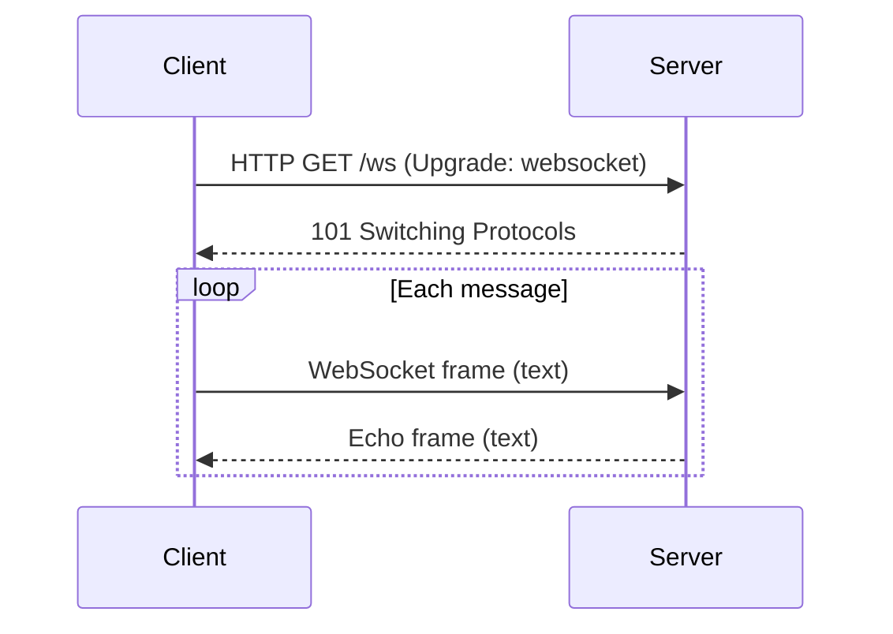
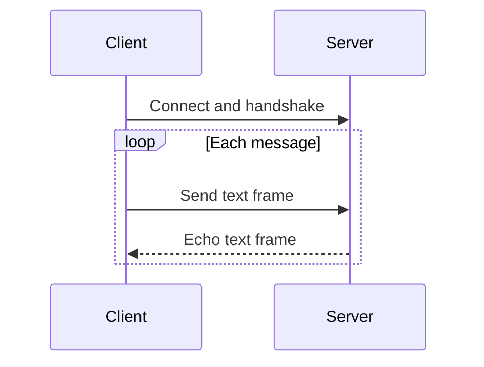
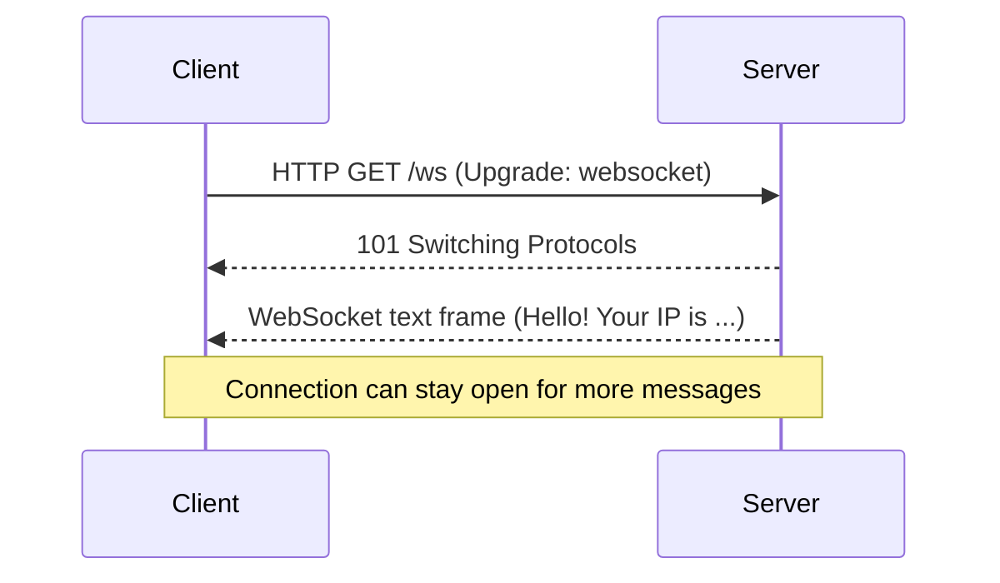
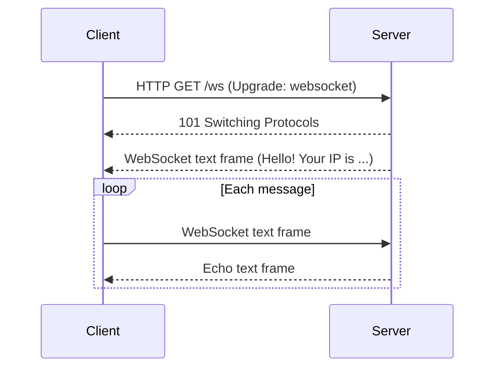

# WebSockets: Real-Time Communication in Go ⚡

> "Imagine a phone call instead of sending letters: both sides can talk and listen at any time, instantly. WebSockets turn HTTP from a one-way street into a two-way highway!"

---

## 🚦 Why WebSockets? (Deeper Theory)
- **What are WebSockets?**
  - WebSockets are a protocol that enables full-duplex (two-way), persistent communication between a client (usually a browser) and a server over a single TCP connection.
  - Unlike HTTP, which is request/response and stateless, WebSockets keep the connection open, allowing both sides to send data at any time.
- **Why were they invented?**
  - Traditional HTTP is not efficient for real-time apps (e.g., chat, games, live dashboards) because it requires repeated polling or long-polling, which is slow and resource-intensive.
  - WebSockets solve this by providing a low-latency, always-on channel.
- **How do they work?**
  - Start as an HTTP request, then "upgrade" to the WebSocket protocol (RFC 6455).
  - After the handshake, both client and server can send messages independently.
- **When should you use WebSockets?**
  - When you need real-time, low-latency, bidirectional communication.
  - Examples: chat apps, collaborative editing, multiplayer games, live notifications, financial tickers, IoT device control.
- **When NOT to use WebSockets?**
  - For simple request/response APIs (REST), static content, or when you only need occasional updates (HTTP polling or SSE may be simpler).
  - If you need robust message delivery guarantees (use protocols like MQTT or AMQP).

---

## 🌐 Networking Theory: Where Do WebSockets Fit?
- **Layer:** WebSockets operate at the application layer, on top of TCP.
- **Port:** Usually use the same ports as HTTP/HTTPS (80/443), so they work through most firewalls and proxies.
- **Protocol:** After the handshake, the protocol is no longer HTTP, but a binary framing protocol defined by RFC 6455.
- **Security:** WebSockets can be encrypted (wss://, over TLS/SSL) for secure communication.

---

## ✅ Advantages of WebSockets
- **Low latency:** No need to re-establish connections for each message.
- **Bidirectional:** Both client and server can send messages at any time.
- **Efficient:** Less overhead than HTTP polling or long-polling.
- **Scalable:** Good for apps with many simultaneous connections (with proper server design).

## ❌ Disadvantages of WebSockets
- **Stateful:** Server must keep track of open connections (uses more memory).
- **Complexity:** More complex to implement and debug than simple HTTP.
- **Not cacheable:** No built-in caching or intermediaries like HTTP.
- **Firewall/Proxy issues:** Some corporate proxies may block or interfere with WebSockets.
- **No built-in message delivery guarantees:** If you need guaranteed delivery, you must implement it yourself or use another protocol.

---

## 🧰 Go Packages for WebSockets
- **gorilla/websocket:** The most popular, robust, and well-documented WebSocket package for Go. Handles handshake, frames, and provides a simple API.
- **nhooyr.io/websocket:** Modern, minimal, and context-aware WebSocket library for Go.
- **gobwas/ws:** High-performance, low-level WebSocket library for Go.
- **Native (net/http + manual):** For learning, you can implement the protocol yourself using only the standard library, but this is not recommended for production.

**How to use them:**
- For most projects, use `gorilla/websocket` for ease and reliability.
- For advanced or high-performance needs, consider `gobwas/ws` or `nhooyr.io/websocket`.
- Use native/manual only for educational purposes or if you need full control.

---

## 🧑‍💻 Example Use Cases
- **Chat server:** Real-time messaging between users.
- **Live notifications:** Push updates to clients instantly (e.g., social media, news, stock prices).
- **Collaborative editing:** Multiple users editing the same document in real time.
- **Online games:** Fast, interactive gameplay with many players.
- **IoT control:** Devices send and receive commands instantly.

---

## 🧠 How WebSockets Work (vs HTTP)
- **HTTP:** Client sends a request, server replies, then connection closes.
- **WebSocket:** Client requests an upgrade, server agrees, then both can send/receive messages until one closes the connection.

---

## 🛠️ Go in Action: WebSocket Echo Server (Gorilla)

Let’s build a simple WebSocket echo server using the popular [gorilla/websocket](https://github.com/gorilla/websocket) package.

### How it works (step by step):
1. The client connects to `/ws` via HTTP and requests an upgrade to WebSocket.
2. The server upgrades the connection and enters a loop.
3. For each message received, the server echoes it back to the client.

### Code (see full comments in the file):
See: [`main.go`](../../exercises/part2/12-websocket-echo-server/main.go)

**How to use:**
- Run the server: `go run exercises/part2/12-websocket-echo-server/main.go`
- Connect with the provided Go client, browser JS, or a tool like `wscat`.

---

## 🛠️ Go in Action: WebSocket Client Example (Gorilla)

This client connects to the echo server, sends a message every second, and prints any received messages.

See: [`main.go`](../../exercises/part2/12-websocket-client/main.go)

**How to use:**
- Run the client: `go run exercises/part2/12-websocket-client/main.go`
- Observe the sent and echoed messages in the terminal.

---

## 🛠️ Go in Action: Native WebSocket Echo Server (No Third-Party Packages)

Go’s standard library does not provide a high-level WebSocket API, but you can implement the protocol manually for learning purposes.

### How it works (step by step):
1. The client connects to `/ws` and requests an upgrade.
2. The server performs the WebSocket handshake (RFC 6455).
3. The server enters a loop: reads a frame, decodes, and echoes it back.

See: [`main.go`](../../exercises/part2/12-websocket-native-server/main.go)

**How to use:**
- Run the server: `go run exercises/part2/12-websocket-native-server/main.go`
- Connect with the provided native Go client or a tool like `wscat` (simple text frames only).

---

## 🛠️ Go in Action: Native WebSocket Client

This client connects to the native server, performs the handshake, and allows you to type messages to send and receive echoes.

See: [`main.go`](../../exercises/part2/12-websocket-native-client/main.go)

**How to use:**
- Run the client: `go run exercises/part2/12-websocket-native-client/main.go`
- Type messages in the terminal and see the echoed responses.

---

## 🛠️ Go in Action: Native WebSocket Hello Server (Greets with Client IP)

This advanced example shows how to implement a native WebSocket server (no third-party packages) that greets each client with a message including their IP address.

### How it works (step by step):
1. The client connects to `/ws` and requests an upgrade to WebSocket.
2. The server performs the WebSocket handshake (RFC 6455).
3. The server extracts the client's IP address from the connection.
4. The server sends a WebSocket text frame: `Hello! Your IP is ...`.
5. The connection can be closed or kept open for further communication.

See: [`main.go`](../../exercises/part2/12-websocket-hello-server/main.go)

**How to use:**
- Run the server: `go run exercises/part2/12-websocket-hello-server/main.go`
- Connect with a WebSocket client (e.g., browser JS, `wscat`, or your own Go client) to `ws://localhost:8080/ws`.
- You will receive a greeting message with your IP address.

**Understanding:**
- The server manually handles the handshake and frame encoding.
- The greeting is sent as a WebSocket text frame immediately after the handshake.
- This is a minimal, educational example—production code should use a robust library.

---

## 🛠️ Go in Action: WebSocket Hello Server (Gorilla, Greets with Client IP)

This example uses the gorilla/websocket package to greet each client with their IP address as soon as they connect.

### How it works (step by step):
1. The client connects to `/ws` via HTTP and requests an upgrade to WebSocket.
2. The server upgrades the connection using Gorilla's Upgrader.
3. The server extracts the client's IP address from the HTTP request.
4. The server sends a greeting message: `Hello! Your IP is ...` as a WebSocket text frame.
5. The server enters an echo loop: any message sent by the client is echoed back.

See: [`main.go`](../../exercises/part2/12-websocket-hello-server-gorilla/main.go)

**How to use:**
- Run the server: `go run exercises/part2/12-websocket-hello-server-gorilla/main.go`
- Connect with a WebSocket client (browser JS, `wscat`, or your own Go client) to `ws://localhost:8080/ws`.
- You will receive a greeting message with your IP address, and any message you send will be echoed back.

**Understanding:**
- The server uses Gorilla's Upgrader to handle the handshake and WebSocket protocol.
- The greeting is sent immediately after the connection is established.
- The echo loop allows for further communication.
- The code is fully commented for clarity.

---

## 📝 Understanding the Code (Native Example)

### Server (Native)
- Handles the HTTP upgrade handshake manually (see `wsHandler`).
- Reads and writes WebSocket frames according to RFC 6455.
- Echoes back any text message received.
- Handles only simple text frames (no binary, no fragmentation, no extensions).

### Client (Native)
- Connects via TCP, sends the WebSocket handshake, and parses the response.
- Sends text frames in the correct format.
- Reads and decodes echoed frames from the server.

**All code is fully commented in the example files.**

---

## 🧪 Practical Exercise Files
- [WebSocket Echo Server Example (Gorilla)](../../exercises/part2/12-websocket-echo-server/main.go)
- [WebSocket Client Example (Gorilla)](../../exercises/part2/12-websocket-client/main.go)
- [Native WebSocket Echo Server Example](../../exercises/part2/12-websocket-native-server/main.go)
- [Native WebSocket Client Example](../../exercises/part2/12-websocket-native-client/main.go)
- [Native WebSocket Hello Server Example](../../exercises/part2/12-websocket-hello-server/main.go)
- [WebSocket Hello Server Example (Gorilla)](../../exercises/part2/12-websocket-hello-server-gorilla/main.go)

---

## 🧠 Key Takeaways
- WebSockets enable real-time, bidirectional communication over a single connection.
- Use the `gorilla/websocket` package for robust WebSocket support in Go.
- For learning, you can implement the protocol natively using only the standard library.
- Always handle errors and close connections properly.
- Test with browser dev tools, `wscat`, or your own Go client.

---

[Previous: Handling JSON and XML over HTTP](11-handling-json-and-xml-over-http.md) | [Next: Chat Applications](13-chat-applications.md)
