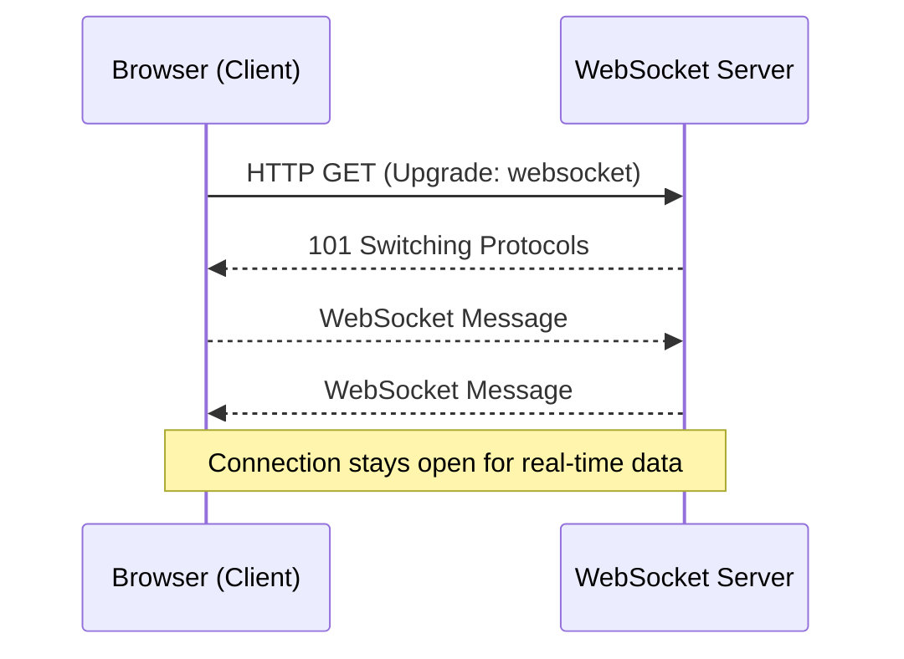

# WebSockets: Real-Time Communication in Go ⚡

> "Imagine a phone call instead of sending letters: both sides can talk and listen at any time, instantly. WebSockets turn HTTP from a one-way street into a two-way highway!"

---

## 🚦 Why WebSockets?
- **Real-Time:** Enables instant, bidirectional communication between client and server.
- **Persistent Connection:** Unlike HTTP, the connection stays open for ongoing data exchange.
- **Use Cases:** Chat apps, live notifications, games, collaborative tools, IoT.
- **Analogy:** Like a walkie-talkie—both sides can send and receive messages at any time.

---

## 🧠 How WebSockets Work (vs HTTP)
- **HTTP:** Client sends a request, server replies, then connection closes.
- **WebSocket:** Client requests an upgrade, server agrees, then both can send/receive messages until one closes the connection.



---

## 🛠️ Go in Action: WebSocket Echo Server (Gorilla)

Let’s build a simple WebSocket echo server using the popular [gorilla/websocket](https://github.com/gorilla/websocket) package.

### Install the package
```sh
# In your project directory:
go get github.com/gorilla/websocket
```

### Server Example: Echo Messages
See: [`main.go`](../../exercises/part2/12-websocket-echo-server/main.go)

---

## 🛠️ Go in Action: WebSocket Client Example (Gorilla)
See: [`main.go`](../../exercises/part2/12-websocket-client/main.go)

---

## 🛠️ Go in Action: Native WebSocket Echo Server (No Third-Party Packages)

Go’s standard library does not provide a high-level WebSocket API, but you can implement the protocol manually for learning purposes.

### Server Example: Native WebSocket Echo
See: [`main.go`](../../exercises/part2/12-websocket-native-server/main.go)

```go
// ...see exercises/part2/12-websocket-native-server/main.go for full code and comments...
```

### Client Example: Native WebSocket Client
See: [`main.go`](../../exercises/part2/12-websocket-native-client/main.go)

```go
// ...see exercises/part2/12-websocket-native-client/main.go for full code and comments...
```

**Note:**
- The native server and client must be in separate folders because both declare `package main` and a `main()` function. This is a Go requirement for building and running each as a standalone program.

**Key Details:**
- The handshake is performed by hijacking the HTTP connection and responding with the correct headers.
- Frames are read and written according to the WebSocket protocol (RFC 6455).
- Only simple text frames are supported in these minimal examples.
- This approach is for educational purposes—use a library like gorilla/websocket for production.

**Testing:**
- Use browser dev tools, `wscat`, or the provided Go client to connect and test.
- To run the native server: `go run exercises/part2/12-websocket-native-server/main.go`
- To run the native client: `go run exercises/part2/12-websocket-native-client/main.go`

---

## 🧪 Practical Exercise Files
- [WebSocket Echo Server Example (Gorilla)](../../exercises/part2/12-websocket-echo-server/main.go)
- [WebSocket Client Example (Gorilla)](../../exercises/part2/12-websocket-client/main.go)
- [Native WebSocket Echo Server Example](../../exercises/part2/12-websocket-native-server/main.go)
- [Native WebSocket Client Example](../../exercises/part2/12-websocket-native-client/main.go)

---

## 🧠 Key Takeaways
- WebSockets enable real-time, bidirectional communication over a single connection.
- Use the `gorilla/websocket` package for robust WebSocket support in Go.
- For learning, you can implement the protocol natively using only the standard library.
- Always handle errors and close connections properly.
- Test with browser dev tools, `wscat`, or your own Go client.

---

[Previous: Handling JSON and XML over HTTP](11-handling-json-and-xml-over-http.md) | [Next: Chat Applications](13-chat-applications.md)
