# Chat Applications: Design, Protocols, and Go Implementation 💬

> "Imagine a group conversation where everyone can speak and listen in real time. Chat applications are the classic use case for WebSockets and real-time networking!"

---

## 🚦 Why Build a Chat Application?
- **Real-Time Communication:** Users expect instant delivery and receipt of messages.
- **Multi-User:** Many clients can join, send, and receive messages simultaneously.
- **Practical:** Chat is a foundation for collaborative tools, games, support systems, and more.
- **Learning:** Building a chat app teaches you about concurrency, broadcasting, and protocol design.

---

## 🧩 Chat Protocols and Architecture
- **WebSocket-Based:** Most modern chat apps use WebSockets for low-latency, bidirectional messaging.
- **Message Format:** Typically JSON (e.g., `{ "user": "Alice", "msg": "Hello!" }`).
- **Broadcast:** Server receives a message and sends it to all connected clients.
- **Rooms/Channels:** Advanced systems support multiple chat rooms or private messages.

---

## 🏗️ Typical Chat Server Architecture


---

## 🛠️ Go in Action: Minimal WebSocket Chat Server (Gorilla)

This example shows a minimal chat server using `gorilla/websocket`. All messages from any client are broadcast to all connected clients.

### How it works (step by step):
1. Clients connect to `/ws` and upgrade to WebSocket.
2. Each client is managed by a goroutine.
3. When a client sends a message, the server broadcasts it to all clients.
4. The server handles joining/leaving and message delivery.


---

## 📝 Example: Minimal Go WebSocket Chat Server (Gorilla)

See: [`main.go`](../../exercises/part2/13-chat-server-gorilla/main.go)

```go
// ...see exercises/part2/13-chat-server-gorilla/main.go for full code and comments...
```

**How to use:**
1. Install gorilla/websocket: `go get github.com/gorilla/websocket`
2. Run the server: `go run exercises/part2/13-chat-server-gorilla/main.go`
3. Connect with multiple browser tabs, `wscat`, or your own Go client to `ws://localhost:8080/ws`.
4. Type messages—everyone sees all messages in real time.

**Understanding the code:**
- Each client connection is handled in its own goroutine.
- All messages are sent to a broadcast channel.
- The server loops over the broadcast channel and sends each message to all connected clients.
- If a client disconnects, it is removed from the list.

---

## 🚀 Ejemplo avanzado: Chat WebSocket con usuario y hora (Gorilla)

En este ejemplo, cada usuario elige su nombre antes de conectarse. Los mensajes enviados incluyen el nombre del remitente y la hora de envío, lo que hace el chat más realista y útil.

### ¿Cómo funciona?
1. El cliente solicita el nombre de usuario antes de conectarse.
2. Al enviar un mensaje, el cliente envía un objeto JSON con el usuario y el texto.
3. El servidor agrega la hora de envío y reenvía el mensaje a todos los clientes conectados.
4. Todos los clientes ven los mensajes con el nombre del remitente y la hora.

```mermaid
sequenceDiagram
    participant UserA as Usuario A
    participant UserB as Usuario B
    participant Server as Servidor
    UserA->>Server: Conectar (envía nombre)
    UserB->>Server: Conectar (envía nombre)
    UserA->>Server: {"user": "Ana", "msg": "¡Hola!"}
    Server-->>UserA: {"user": "Ana", "msg": "¡Hola!", "time": "10:01"}
    Server-->>UserB: {"user": "Ana", "msg": "¡Hola!", "time": "10:01"}
    UserB->>Server: {"user": "Luis", "msg": "¡Hola Ana!"}
    Server-->>UserA: {"user": "Luis", "msg": "¡Hola Ana!", "time": "10:02"}
    Server-->>UserB: {"user": "Luis", "msg": "¡Hola Ana!", "time": "10:02"}
```



---

### 📂 Archivos de ejercicio
- [Servidor avanzado de chat (Gorilla)](../../exercises/part2/13-chat-server-advanced-gorilla/main.go)
- [Cliente avanzado de chat (Gorilla)](../../exercises/part2/13-chat-client-advanced-gorilla/main.go)

---

### 🏃‍♂️ Cómo usarlo
1. Instala gorilla/websocket: `go get github.com/gorilla/websocket`
2. Ejecuta el servidor: `go run exercises/part2/13-chat-server-advanced-gorilla/main.go`
3. Ejecuta el cliente: `go run exercises/part2/13-chat-client-advanced-gorilla/main.go`
4. Escribe tu nombre de usuario cuando lo pida el cliente.
5. Escribe mensajes y observa cómo aparecen con tu nombre y la hora en todos los clientes conectados.

---

### 🧑‍💻 Formato de mensaje
Los mensajes entre cliente y servidor usan JSON:
```json
{
  "user": "Ana",
  "msg": "¡Hola!",
  "time": "2025-06-22T10:01:00"
}
```
- `user`: Nombre del remitente
- `msg`: Texto del mensaje
- `time`: Hora de envío (formato ISO8601)

---

### 📝 Explicación del código
- El servidor espera que cada cliente envíe su nombre al conectarse.
- Cada mensaje recibido se marca con la hora actual y se reenvía a todos los clientes.
- El cliente muestra los mensajes en formato: `[hora] usuario: mensaje`.
- El código está completamente comentado y explicado en los archivos de ejercicio.

---

## 🧠 Key Takeaways
- Chat apps are a classic real-time networking challenge—perfect for learning concurrency, broadcasting, and protocol design.
- Use WebSockets for low-latency, bidirectional messaging.
- Manage clients and broadcasts with goroutines and channels in Go.
- For production, add authentication, rooms, message history, and error handling.

---

[Previous: WebSockets: Real-Time Communication](12-websockets-real-time-communication.md) | [Next: File Transfer Applications](14-file-transfer-applications.md)

**How to use the Go client:**
1. Install gorilla/websocket: `go get github.com/gorilla/websocket`
2. Run the chat server: `go run exercises/part2/13-chat-server-gorilla/main.go`
3. In another terminal, run the client: `go run exercises/part2/13-chat-client-gorilla/main.go`
4. Type messages in the client—see them broadcast to all connected clients (including browser tabs or other Go clients).
