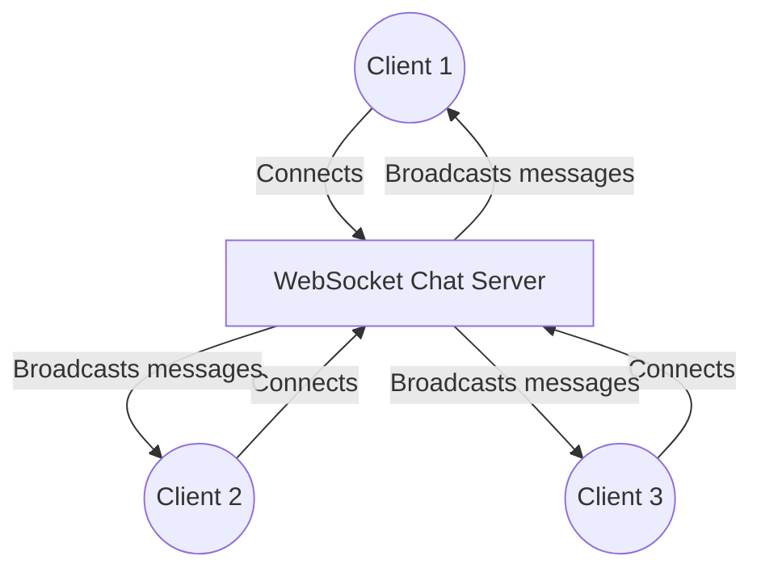
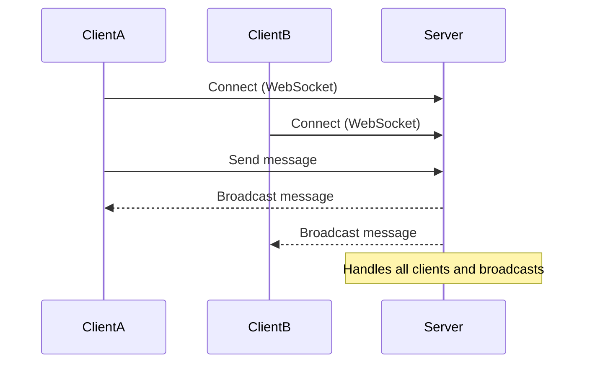
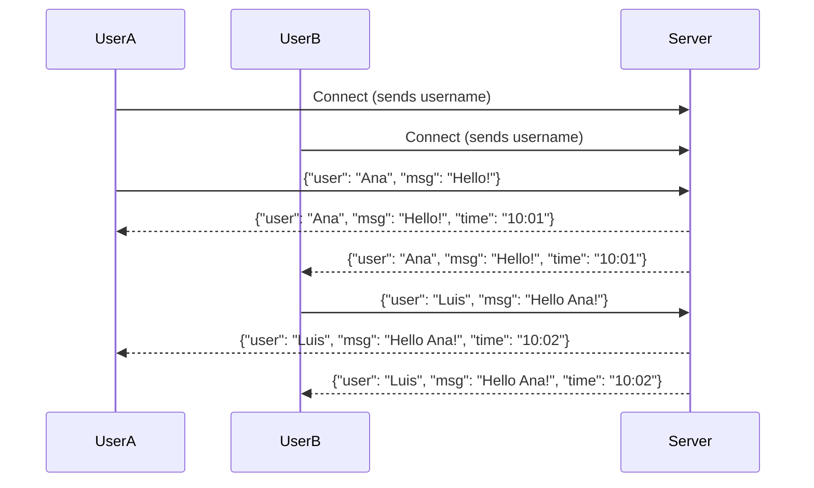

# Chat Applications: Design, Protocols, and Go Implementation

> "Imagine a group conversation where everyone can speak and listen in real time. Chat applications are the classic use case for WebSockets and real-time networking!"

---

## Why Build a Chat Application?
- **Real-Time Communication:** Users expect instant delivery and receipt of messages.
- **Multi-User:** Many clients can join, send, and receive messages simultaneously.
- **Practical:** Chat is a foundation for collaborative tools, games, support systems, and more.
- **Learning:** Building a chat app teaches you about concurrency, broadcasting, and protocol design.
- **A concurrency crucible:** Shared state, backpressure, graceful shutdown, and resource
  leaks all show up in a chat server, which is why it's such a popular teaching example.

<Axiom>A chat server is a distributed systems problem wearing a friendly disguise: dozens of independent goroutines all racing to agree on "who said what, in what order."</Axiom>

---

## Chat Protocols and Architecture
- **WebSocket-Based:** Most modern chat apps use WebSockets for low-latency, bidirectional messaging.
- **Message Format:** Typically JSON (e.g., `{ "user": "Alice", "msg": "Hello!" }`).
- **Broadcast:** Server receives a message and sends it to all connected clients.
- **Rooms/Channels:** Advanced systems support multiple chat rooms or private messages.

---

## Typical Chat Server Architecture



### Why Not Just Loop Over Every Connection?

The diagram makes broadcasting look trivial: one message in, fan it out to everyone. The
hard part is *coordination* — many goroutines (one per client) must agree on a single,
consistent set of "who is currently connected" while clients keep joining and leaving. Go
gives you two idiomatic ways to solve this. **Option A** is a package-level
`map[*Client]bool` protected by a `sync.Mutex` — simple, but every goroutine touching the
map must remember to lock it, or you get a data race. **Option B** is a single hub goroutine
that owns the map privately, reachable only over channels (`register <- client`,
`broadcast <- msg`); since one goroutine touches the map, a race is impossible by
construction. The example server below picks Option A, so this book shows both approaches.

<DeepDive title="Mutex vs. channel-owned state: which should you reach for?">A mutex-guarded map stays passively available to any goroutine that wants to read it — handy if an HTTP handler outside the hub needs to answer "list current users." A channel-owned hub keeps all coordination in one readable `for { select {} }` loop, turning "only one goroutine touches this data" into a structural guarantee rather than a convention to remember. Reach for a mutex when the shared state is simple and read from many places; reach for a hub goroutine when the *operations* (register, unregister, broadcast, room changes) are what you want serialized in one place.</DeepDive>

<Axiom>Locks protect shared memory; a hub goroutine deletes the sharing altogether by giving one goroutine sole ownership and a mailbox. Pick whichever removes more bugs from your specific design, not whichever is more fashionable.</Axiom>

---

## Go in Action: Minimal WebSocket Chat Server (Gorilla)

This example shows a minimal chat server using `gorilla/websocket`. All messages from any client are broadcast to all connected clients.

### How it works (step by step):
1. Clients connect to `/ws` and upgrade to WebSocket.
2. Each client is managed by a goroutine.
3. When a client sends a message, the server broadcasts it to all clients.
4. The server handles joining/leaving and message delivery.



This server keeps a `sync.Mutex`-guarded `map[*Client]bool` (Option A above), plus a
package-level `broadcast chan []byte` and a goroutine that ranges over the map for every
incoming message. Each `Client` also owns a buffered `send chan []byte`, drained by its own
writer goroutine. The connection's original goroutine only *reads* from the socket and
pushes onto `broadcast` — it never writes to the connection directly.

<Warning title="Why the broadcast loop never calls conn.WriteMessage itself">It's tempting to have the broadcast goroutine call `client.conn.WriteMessage(...)` directly for every client. Don't: a `*websocket.Conn` is not safe for concurrent writes, and if a client's own goroutine writes back at the same moment, the frames can interleave and corrupt the connection. Routing every outbound message through a per-client channel, drained by exactly one writer goroutine, guarantees a single writer per connection.</Warning>

<Warning title="A blocking send to one slow client stalls everyone">An unbuffered `client.send <- msg` blocks indefinitely on one slow client — and since the broadcast loop iterates sequentially, every *other* client stops receiving too. Fix it with a **bounded** channel and a non-blocking send: `select { case client.send <- msg: default: /* drop */ }`. A full buffer marks the client too slow, so it gets disconnected rather than freezing the room. Buffer size is a real knob: too small triggers false disconnects on bursts, too large wastes memory.</Warning>

<Warning title="Forgetting to unregister a client leaks memory forever">A client never removed from the map (on error, disconnect, or failed write) stays there forever in a long-running server, along with its reader and writer goroutines — a silent memory and goroutine leak that's easy to miss in development and painful in production. Always remove the client inside a `defer`, right after registration.</Warning>

---

## Example: Minimal Go WebSocket Chat Server (Gorilla)

See: [`main.go`](../../exercises/part2/13-chat-server-gorilla/main.go)

```go
// ...see exercises/part2/13-chat-server-gorilla/main.go
// for the full, commented code...
```

**How to use:**
1. Install gorilla/websocket: `go get github.com/gorilla/websocket`
2. Run the server: `go run exercises/part2/13-chat-server-gorilla/main.go`
3. Connect with multiple browser tabs, `wscat`, or your own Go client to `ws://localhost:8080/ws`.
4. Or run the bundled Go client: `go run exercises/part2/13-chat-client-gorilla/main.go`
5. Type messages in any client — everyone sees them in real time.

**Understanding the code:**
- Each client connection has its own reader goroutine and its own writer goroutine.
- All incoming messages are pushed onto a single `broadcast` channel.
- The broadcast goroutine loops over the client map, pushing to each client's channel with
  a non-blocking `select` that drops clients who can't keep up.
- On disconnect, a client is removed from the map and its channel closed, letting its
  writer goroutine exit cleanly — preventing a goroutine leak.

---

## Advanced Example: Chat WebSocket with Username and Timestamp (Gorilla)

In this example, each user chooses a username before connecting. Messages sent include the
sender's name and the time it was sent, which makes the chat feel more realistic and useful.

### How it works:
1. The client is prompted for a username before connecting.
2. When sending a message, the client sends a JSON object with the username and text.
3. The server adds a timestamp and re-broadcasts the message to all connected clients.
4. Every client sees messages annotated with the sender's name and the time.



### Exercise files
- [Advanced chat server (Gorilla)](../../exercises/part2/13-chat-server-advanced-gorilla/main.go)
- [Advanced chat client (Gorilla)](../../exercises/part2/13-chat-client-advanced-gorilla/main.go)

### How to use it
1. Install gorilla/websocket: `go get github.com/gorilla/websocket`
2. Run the server: `go run exercises/part2/13-chat-server-advanced-gorilla/main.go`
3. Run the client: `go run exercises/part2/13-chat-client-advanced-gorilla/main.go`
4. Enter a username when the client prompts for one.
5. Type messages and watch them appear with your name and the time on every connected client.

### Message format
Client and server exchange JSON:
```json
{
  "user": "Ana",
  "msg": "Hello!",
  "time": "2025-06-22T10:01:00"
}
```
- `user`: sender's name
- `msg`: message text
- `time`: send time (ISO 8601 format)

### Code explanation
- The server expects each client's username as the very first message, a lightweight
  handshake before the normal read loop begins.
- Every incoming message is stamped with the current server time and rebroadcast; the
  client displays it as `[time] user: message`.
- The full, commented code lives in the exercise files linked above.

<Warning title="Never trust the username a client sends you">This handshake uses whatever string the client sends, verbatim, as the display name. A buggy or malicious client could send an empty string, thousands of characters, or control characters/HTML that break rendering if the message is ever shown in a browser without escaping. At minimum, trim whitespace, enforce a maximum length, and reject anything that isn't printable text before storing or broadcasting a username.</Warning>

<DeepDive title="Presence and typing indicators">Once you have a username handshake, two common chat features fall out almost for free. **Presence** ("who's online") is just the current key set of the client map, broadcast whenever someone joins or leaves — see the next section. **Typing indicators** are a variation on the same pipeline: the client sends `{"type": "typing", "user": "Ana"}` when typing starts (and again when it stops or times out), and the server rebroadcasts it like any other message — no new infrastructure needed.</DeepDive>

---

## Extending the Example: Join/Leave System Messages

A chat room feels more alive when people can see others arrive and depart. This is a
natural next feature for the advanced example, and it only touches code you already have:
the `Message` struct and the connection handler's setup and cleanup.

```go
// A flag marking system events (joins, leaves) for rendering.
type Message struct {
    User   string `json:"user"`
    Text   string `json:"msg"`
    Time   string `json:"time"`
    System bool   `json:"system,omitempty"`
}

// After the handshake succeeds, before the read loop:
broadcast <- Message{
    User:   username,
    Text:   username + " joined the chat",
    Time:   time.Now().Format(time.RFC3339),
    System: true,
}

// Deferred right after registering, so it always runs:
defer func() {
    clientsMu.Lock()
    delete(clients, client)
    clientsMu.Unlock()

    broadcast <- Message{
        User:   username,
        Text:   username + " left the chat",
        Time:   time.Now().Format(time.RFC3339),
        System: true,
    }
}()
```

The client side just checks the `System` field and renders those messages in a different
style (dimmed, centered, no "reply" affordance) instead of as a normal chat bubble.

<Axiom>The difference between a toy echo broadcaster and a chat application is almost entirely in the edges — joins, leaves, slow clients, bad input — not in the happy path of "send a message, everyone gets it."</Axiom>

---

## Scaling Beyond a Single Process

Everything in this chapter runs one hub in one process — right for learning and small
deployments, but with a hard ceiling: a client on *process A* can never receive a broadcast
from *process B*, since the hub's map and channels only exist in one process's memory.

<DeepDive title="From an in-process hub to a shared message bus">Multi-instance production chat systems solve this by replacing the in-process `broadcast` channel with a shared, external message bus — Redis Pub/Sub, NATS, or a Kafka topic. Each instance still runs its own local hub exactly as described here; the only change is that it also subscribes to the shared bus and re-publishes to it, so a message from instance A's client reaches instance B's clients too. Beyond this book's scope, but the key insight is that the pattern *composes*: you federate the hub design to scale, not discard it.</DeepDive>

---

## Try It Yourself

Pick one of the exercise servers from this chapter and extend it with one of the following.
Each is a small, self-contained change that exercises a real concurrency lesson:

- **Add join/leave system messages** to the basic (non-advanced) server, adapting the
  pattern shown above to its plain `[]byte` broadcast instead of the `Message` struct.
- **Make the client buffer size configurable** and experiment: connect a client, stop
  reading from it, and watch how quickly it gets disconnected at different buffer sizes.
- **Write a unit test for the broadcast logic**, independent of any real network
  connection, using an in-memory hub like the one below:

```go
type Client struct {
    send chan []byte
}

type Hub struct {
    clients    map[*Client]bool
    register   chan *Client
    unregister chan *Client
    broadcast  chan []byte
}

func newHub() *Hub {
    return &Hub{
        clients:    make(map[*Client]bool),
        register:   make(chan *Client),
        unregister: make(chan *Client),
        broadcast:  make(chan []byte),
    }
}

func (h *Hub) run() {
    for {
        select {
        case c := <-h.register:
            h.clients[c] = true
        case c := <-h.unregister:
            if _, ok := h.clients[c]; ok {
                delete(h.clients, c)
                close(c.send)
            }
        case msg := <-h.broadcast:
            for c := range h.clients {
                select {
                case c.send <- msg:
                default:
                    delete(h.clients, c)
                    close(c.send)
                }
            }
        }
    }
}
```

```go
func TestHubBroadcast(t *testing.T) {
    h := newHub()
    go h.run()

    c1 := &Client{send: make(chan []byte, 4)}
    c2 := &Client{send: make(chan []byte, 4)}
    h.register <- c1
    h.register <- c2

    h.broadcast <- []byte("hello")

    for _, c := range []*Client{c1, c2} {
        select {
        case msg := <-c.send:
            if string(msg) != "hello" {
                t.Fatalf("got %q, want %q", msg, "hello")
            }
        case <-time.After(time.Second):
            t.Fatal("timed out waiting for broadcast")
        }
    }
}
```

This `Hub` is the "Option B" design from earlier: a single goroutine owns the map, so the
test never needs a mutex, a real socket, or a running server — just `go test`, which is why
designing for testability often pushes you toward channel-owned state at component
boundaries.

---

## Key Takeaways
- Chat apps are a classic real-time networking challenge — perfect for learning concurrency, broadcasting, and protocol design.
- Use WebSockets for low-latency, bidirectional messaging.
- Manage clients and broadcasts with goroutines and channels in Go, whether via a
  mutex-guarded map or a channel-owned hub — pick based on how much of the coordination
  logic you want serialized into one place.
- Give every connection exactly one writer goroutine, fed by a buffered channel, so
  concurrent writes never corrupt the socket and one slow client never blocks the rest.
- Always unregister clients on disconnect — in a `defer` — to avoid memory and goroutine
  leaks in a long-running server.
- For production, add authentication, rooms, message history, presence, and a shared
  message bus if you need to scale across multiple server instances.
